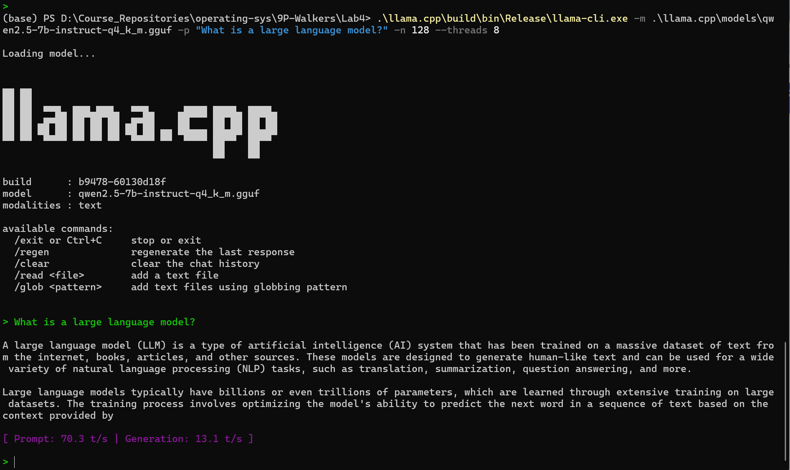

# OSH LAB4 report

## 一、实验环境

| 项目           | 内容                                                                                    |
| -------------- | --------------------------------------------------------------------------------------- |
| CPU            | Intel Core i9-14900HX（24 核：8 P-core + 16 E-core，共 32 逻辑线程）                    |
| 内存           | 32 GB（约 31.7 GB 可用）                                                                |
| GPU            | NVIDIA GeForce RTX 4060 Laptop（8 GB 显存） + Intel UHD Graphics（核显）                |
| 操作系统       | Windows 11 Home China（10.0.26200）                                                     |
| llama.cpp 版本 | build 9478（commit `60130d18f`），MSVC 19.51 x64                                      |
| 构建方式       | CMake + MSVC，`-B build`，`--config Release`（CPU 后端）                            |
| 二进制位置     | `llama.cpp\build\bin\Release\`（llama-cli.exe、llama-bench.exe、llama-server.exe 等） |

> RPC 与 GPU offload 任务需要重新构建（见第六节、第四节优化部分）。

---

## 二、主线部分：llama.cpp

### 2.1 测试性能指标列表

下面列出 6 个 LLM 部署性能指标，并说明选取理由。

|   | 指标                                                | 定义 / 测量方式                                                                       | 选取理由（合理性）                                                                                     |
| - | --------------------------------------------------- | ------------------------------------------------------------------------------------- | ------------------------------------------------------------------------------------------------------ |
| 1 | **加载时间 (Load time)**                      | 从启动进程到模型权重载入完成、可开始推理的时间。llama.cpp 日志中的 `load time`。    | 反映模型从磁盘读入并初始化的开销，直接影响服务冷启动体验，与 `--no-mmap`、磁盘速度、模型大小强相关。 |
| 2 | **首 Token 延迟 (TTFT, Time To First Token)** | 从输入 prompt 到生成第一个 token 的时间，等价于 prompt 预填充 (prefill) 时间。        | 决定交互式场景的"响应快不快"，主要受 prompt 长度、`--batch-size`、线程数影响，是体验类核心指标。     |
| 3 | **输出速度 (Decode throughput)**              | 生成阶段每秒产出 token 数 (tokens/s)，对应 llama-bench 的 `tg`（text generation）。 | 衡量持续生成的吞吐能力，是最常用的性能指标，直接体现部署配置的优劣。                                   |
| 4 | **预填充速度 (Prefill throughput)**           | 处理输入 prompt 阶段每秒 token 数，对应 llama-bench 的 `pp`（prompt processing）。  | 与 decode 分开衡量，能区分"读得快"和"写得快"，长 prompt 场景下尤为重要。                               |
| 5 | **内存占用 (Memory footprint)**               | 推理过程中进程的峰值物理内存 (RSS) / 显存占用。                                       | 决定一台机器能否装下模型、能并发多少请求，是资源约束类的关键指标，与量化格式、`--ctx-size` 相关。    |
| 6 | **输出质量 (Output quality)**                 | 用 perplexity（困惑度）或人工打分评估生成内容的正确性 / 流畅性。                      | 性能不能脱离质量单独看；量化越激进速度越快但质量可能下降，需要一并评估以判断配置是否"可用"。           |

**合理性**：指标 1 覆盖"启动开销"，2/3/4 覆盖"运行时速度"（分别是体验、生成、预填充三个维度），5 覆盖"资源约束"，6 覆盖"效果"。四个维度共同刻画了一个部署方案是否"又快、又省、又好"，避免只看单一吞吐而误判。

### 2.2 GGUF 量化模型单机部署

**选型说明**：本组选用 **Qwen2.5-7B-Instruct**，量化格式 **Q4_K_M**。
理由：7B 规模在 32GB 内存 / 8GB 显存上可纯 CPU 跑、也可部分 GPU offload；Qwen 系列中文能力强，契合后面中文问答 / 课程问答的评估需求；Q4_K_M 在体积、速度、质量之间平衡较好。

| 项目     | 内容                       |
| -------- | -------------------------- |
| 模型名称 | Qwen2.5-7B-Instruct        |
| 参数规模 | 7B                         |
| 量化格式 | Q4_K_M                     |
| 操作系统 | Windows 11                 |
| 下载来源 | ModelScope                 |
| 部署方式 | 单机 CPU 推理（llama-cli） |

**下载命令**：

```powershell
modelscope download --model Qwen/Qwen2.5-7B-Instruct-GGUF qwen2.5-7b-instruct-q4_k_m.gguf --local_dir .\llama.cpp\models
```

**运行命令**：

```powershell
.\llama.cpp\build\bin\Release\llama-cli.exe -m .\llama.cpp\models\qwen2.5-7b-instruct-q4_k_m.gguf -p "What is a large language model?" -n 128 --threads 8
```

**推理结果**：



### 2.3 测试任务设计与指标测量

**测试任务设计**：固定模型（Qwen2.5-7B-Instruct，Q4_K_M）、固定 prompt 与生成长度，分两路测量：

- **吞吐类（prefill / decode）**：用 `llama-bench`，它默认跑 `pp512`（预填充 512 token）与 `tg128`（生成 128 token），并自动重复 5 次输出均值 ± 标准差，结果稳定可比。
- **延迟 / 资源类（加载时间 / TTFT / 峰值内存）**：用 `llama-cli` 单轮（`-st -v`）跑一次固定 prompt，从其计时输出解析 `prompt eval time`（即 TTFT），用脚本轮询进程 RSS 记录峰值物理内存；本机这套 build 不直接打印 `load time`，故用 **墙钟耗时 − 推理总时长** 近似加载时间。

从指标列表中选取 **≥3 个**（实际覆盖 5 个）：①输出速度(decode)、②预填充速度(prefill)、③加载时间、④首 Token 延迟、⑤峰值内存。

**测量命令**：上述流程封装在脚本 `scripts/23_metrics.sh`（一条命令完成 bench + cli + 内存采集，结果写入 `scripts/results/`）：

```bash
# 一键测量（线程数默认 8，可用 --threads / --n-predict 调整）
./scripts/23_metrics.sh --threads 8 --n-predict 128

# 其中 llama-bench 等价于：
./llama.cpp/build/bin/llama-bench -m ./llama.cpp/models/qwen2.5-7b-instruct-q4_k_m.gguf -t 8
```

**测量结果**：

llama-bench 在不同线程数下的吞吐（默认 24 线程 vs 脚本所用 8 线程）：

```text
| model                  |   size | params | backend | threads |  test |          t/s |
| ---------------------- | -----: | -----: | ------- | ------: | ----: | -----------: |
| qwen2 7B Q4_K - Medium | 4.36GiB| 7.62 B | CPU     |      24 | pp512 | 83.93 ± 3.13 |
| qwen2 7B Q4_K - Medium | 4.36GiB| 7.62 B | CPU     |      24 | tg128 | 13.96 ± 0.41 |
| qwen2 7B Q4_K - Medium | 4.36GiB| 7.62 B | CPU     |       8 | pp512 | 71.70 ± 3.29 |
| qwen2 7B Q4_K - Medium | 4.36GiB| 7.62 B | CPU     |       8 | tg128 | 13.47 ± 0.13 |

build: 60130d18f (9478)
```

`23_metrics.sh`（8 线程，prompt≈9 token）实测指标汇总：

| 指标                 | 测量值                                            | 来源                                          |
| -------------------- | ------------------------------------------------- | --------------------------------------------- |
| 加载时间（约）       | **≈ 6773 ms（≈6.8 s）**                           | 墙钟耗时(9.98 s) − 推理总时长(3.21 s)，脚本   |
| 首 Token 延迟 (TTFT) | **≈ 656 ms**                                      | llama-cli `prompt eval time`（`-v`）        |
| Prefill 吞吐 (pp512) | **71.7 ± 3.3 t/s**（8 线程）/ 83.9 ± 3.1（24 线程） | llama-bench                                   |
| Decode 吞吐 (tg128)  | **13.5 ± 0.1 t/s**（8 线程）/ 14.0 ± 0.4（24 线程） | llama-bench                                   |
| 峰值内存             | **≈ 14399 MB（≈14.1 GiB）**                       | 脚本轮询进程 RSS                               |

**结果分析**：

1. **加载时间（≈6.8 s）** 主要花在把 4.36 GiB 的量化权重从磁盘读入并初始化后端上。该值与磁盘速度、是否 `--no-mmap`、模型大小强相关（详见 2.4 第 (4) 项）。
2. **TTFT（≈656 ms）** 是对约 9 个 token 的短 prompt 做预填充的时间；prompt 越长 TTFT 越高，这也是交互式体验的关键。
3. **Prefill 远高于 Decode（71.7 vs 13.5 t/s，约 5.3×）**：预填充阶段可一次性并行处理 prompt 的多个 token，是 **计算密集**型；而 decode 是自回归逐 token 生成，每步都要读一遍全部权重，是 **内存带宽受限**型，所以慢得多。
4. **线程数对两者影响不同**：24 线程相比 8 线程，prefill 提升明显（83.9 vs 71.7，+17%），但 decode 几乎持平（14.0 vs 13.5）。这印证了 decode 受内存带宽而非线程数限制——这一现象在 2.4 的线程扫描中会进一步量化。
5. **峰值内存（≈14.1 GiB）** 高于模型文件本身（4.36 GiB），原因是：mmap 方式下被访问到的模型文件页会计入进程工作集，再叠加 KV cache（与上下文长度相关，见 2.4 第 (3) 项）与计算缓冲区。32 GB 内存可轻松容纳，但也说明纯 CPU 单实例已占用可观内存。

### 2.4 基于部署参数的分析、测试与优化

以 llama.cpp 配置参数为主进行调优。固定模型与 prompt，单独改变一个参数观察影响。各项由脚本 `scripts/24_tune.sh --test <项>` 测得，结果存于 `scripts/results/24_*`。

**(1) 线程数 `--threads`**

```bash
./scripts/24_tune.sh --test threads     # 等价 llama-bench -t 4,8,16,24,32
```

| --threads             | 4     | 8     | 16    | 24        | 32        |
| --------------------- | ----- | ----- | ----- | --------- | --------- |
| prefill pp512 (t/s)   | 41.21 | 63.25 | 63.87 | 69.10     | **75.09** |
| decode  tg128 (t/s)   | 10.19 | 12.87 | 12.75 | **14.02** | 13.20     |

分析：**prefill 随线程数单调上升**，到 32 线程仍最高（计算密集，可吃满更多核，包括 E-core）；**decode 在 24 线程达到峰值（14.02），到 32 线程反而回落**。原因是 decode 是内存带宽受限型，线程过多会加剧带宽争抢，且 E-core 算力弱反而拖累整体。→ prefill 偏好高线程、decode 最优点约在物理核+部分超线程（24）。

**(2) 批大小 `--batch-size` / `-b`**（threads=24）

```bash
./scripts/24_tune.sh --test batch        # 等价 llama-bench -b 128,256,512,1024
```

| -b                  | 128         | 256   | 512   | 1024  |
| ------------------- | ----------- | ----- | ----- | ----- |
| prefill pp512 (t/s) | 74.03±5.66  | 71.36 | 69.92 | 70.18 |
| decode  tg128 (t/s) | 14.37       | 13.53 | 14.33 | 14.21 |

分析：**批大小对 CPU 推理吞吐几乎无影响**（pp512 仅在 70–74 间波动，且 b=128 方差大 ±5.66）。因为 pp512 测试的 prompt 本身就是 512 token、ubatch 默认 512，逻辑 batch 再大也不改变实际并行划分；decode 逐 token 生成更与 batch 无关。→ 在纯 CPU 部署中 `-b` 不是关键调优项。

**(3) 上下文长度 `--ctx-size` / `-c`**（观察对峰值内存的影响）

```bash
./scripts/24_tune.sh --test ctx          # llama-cli -c 512/2048/8192/16384，脚本记录峰值内存
```

| -c (ctx)      | 512    | 2048   | 8192   | 16384  |
| ------------- | ------ | ------ | ------ | ------ |
| 峰值内存 (MB) | 7249.7 | 7333.4 | 7669.8 | 8118.0 |

分析：上下文越大，KV cache 越大，**峰值内存随之线性增长但增幅平缓**（512→16384，仅增加约 868 MB，约 0.053 MB/token）。基准约 7.2 GB 主要来自模型权重（mmap 映射）与计算缓冲，KV cache 在 7B-Q4、万级上下文下占比有限。上下文长度主要影响内存而非速度，按需设置即可。

> 注：本表 -n 仅取 32，峰值内存（约 7.2–8.1 GB）低于 2.3 中的 14.1 GB——后者用了 `-v` 且默认上下文更大、生成更长，工作集（含被访问的 mmap 模型页）更高。

**(4) 内存映射 `--no-mmap`**（threads=24，对比开启/关闭）

```bash
./scripts/24_tune.sh --test mmap         # 等价 llama-bench -mmp 0,1
```

| mmap                | 关闭（`--no-mmap`, 0） | 开启（默认, 1） |
| ------------------- | ---------------------- | --------------- |
| prefill pp512 (t/s) | **86.85**              | 71.30           |
| decode  tg128 (t/s) | **14.14**              | 12.62           |

分析：**关闭 mmap** 会在启动时把整份权重一次性读入物理内存——**加载时间更长、内存占用更实**，但运行时吞吐更高（prefill +22%、decode +12%），因为权重常驻 RAM、访问不再有缺页中断；**开启 mmap（默认）** 则启动快、内存按需分页，代价是首次访问的缺页开销使运行吞吐略低。→ 内存充裕、追求稳定高吞吐时用 `--no-mmap`；追求快速冷启动 / 省内存时用默认 mmap。

**结论**：

- **最优组合**：`--threads 24~32` + `--no-mmap`（内存允许时）。其中 prefill 偏好满线程（32→75 t/s）、`--no-mmap` 再叠加（→ 约 **87 t/s**）；decode 最优点在 24 线程（**14.0 t/s**）。
- **相对默认（24 线程、mmap 开启：prefill 71.3 / decode 12.6 t/s）的提升**：开启 `--no-mmap` 后 prefill **71.3→86.9（+22%）**、decode **12.6→14.1（+12%）**；线程从 8 提到 32，prefill **63→75（+19%）**。
- **原因解析**：① decode 受内存带宽而非线程数限制，故线程数过多（32）时 decode 反降、E-core 拖后腿；② `--no-mmap` 让权重常驻物理内存、消除缺页开销，是本机最有效的单项优化；③ batch / ctx 对速度不敏感（ctx 只影响内存）。

### 2.5 五个 Prompt 的输出质量评估

设计 5 个 prompt，覆盖 **中文问答 / 摘要 / 代码解释 / 推理题 / 课程相关问题**（≥3 类，此处覆盖全部 5 类）。

| # | 类别     | Prompt                                                                                                                       |
| - | -------- | ---------------------------------------------------------------------------------------------------------------------------- |
| 1 | 中文问答 | 请解释什么是"虚拟内存"，并举一个操作系统中的实际例子。                                                                       |
| 2 | 摘要     | 请用不超过 50 字概括下面这段话：……（粘贴一段 200 字左右的技术文字）                                                        |
| 3 | 代码解释 | 解释这段 C 代码的功能，并指出潜在 bug：`int *p; *p = 10;`                                                                  |
| 4 | 推理题   | 一个房间里有 3 个开关，对应房间外的 3 盏灯，每个开关控制一盏。你只能进房间一次，如何确定每个开关对应哪盏灯？请给出推理过程。 |
| 5 | 课程相关 | 在 llama.cpp 中，GGUF 量化（如 Q4_K_M）相比 FP16 为什么能加速推理、又会带来什么代价？                                        |

**测量方式**：用同一模型（Q4_K_M）、同一组 prompt、相同生成长度（n=256），仅改变 **temperature** 做两组对照：

- **配置 A**：`temp=0.7`（较随机，偏发散）—— `scripts/25_quality.sh --tag A --temp 0.7`
- **配置 B**：`temp=0.2`（较确定，偏收敛）—— `scripts/25_quality.sh --tag B --temp 0.2`

输出分别存于 `scripts/results/25_quality_A_<时间戳>/` 与 `25_quality_B_<时间戳>/`（每个 prompt 一个 `pN_类别.txt`）。中文 prompt 通过 UTF-8 文件以 `-f` 传入，避免 Windows 命令行编码乱码。

**两配置各 prompt 输出要点（实测）**：

| # | 类别     | 配置 A（temp=0.7）输出要点                                  | 配置 B（temp=0.2）输出要点                                 |
| - | -------- | ---------------------------------------------------------- | --------------------------------------------------------- |
| 1 | 中文问答 | 正确定义虚拟内存，举 **Linux 页表 / 缺页换入** 例子。      | 正确定义，举 **Windows 分页文件（交换文件）** 例子，并补充频繁换页降低性能。 |
| 2 | 摘要     | ≈45 字，未超 50 字且切题。                                  | ≈46 字，未超 50 字且切题，措辞更凝练。                     |
| 3 | 代码解释 | 准确指出未初始化（野）指针、`*p=10` 解引用为未定义行为。   | 同样准确，分步骤列出更条理化。                             |
| 4 | 推理题   | 经典加热法正解：开 A 加热→关 A 开 B→亮=B、温热=A、冷=C。   | 同样采用加热法，思路正确（结构略简）。                     |
| 5 | 课程相关 | 切题解释加速来源（更小权重/更低访存）与代价（精度损失）。  | 条理清晰，但出现一处事实错误："FP16 比 FP32 大一倍"（实为更小）。 |

**质量初评（1–5 分，正确性/完整性/流畅性综合，基于真实输出，待人工复核）**：

| Prompt     | 配置A（temp=0.7） | 配置B（temp=0.2） | 备注 |
| ---------- | ----------------- | ----------------- | ---- |
| 1 中文问答 | 5 | 5 | 均正确完整；A 举 Linux、B 举 Windows，例子不同但都恰当 |
| 2 摘要     | 5 | 5 | 均 50 字内、信息无遗漏 |
| 3 代码解释 | 5 | 5 | 均正确识别野指针 / 未定义行为 |
| 4 推理题   | 5 | 5 | 均给出经典加热法正解 |
| 5 课程相关 | 4 | 3 | A 略浅；B 含一处 FP16/FP32 大小的事实性错误 |
| **合计**   | **24/25** | **21/25** | —— |

> 评分维度：正确性 / 完整性 / 流畅性综合取整。上表依据真实输出初评，建议再由人工确认并附输出截图。
> **结论**：① 两种 temperature 下 Q4_K_M 在 5 类任务上**质量都相当可用**，推理题与代码题均给出正确答案，说明该量化未明显损害逻辑能力；② temp=0.2（B）回答更**结构化、确定**，但本次在课程题 #5 上出现一处事实错误，提示**低温并不能消除事实性幻觉**（幻觉与采样温度无必然关系，更取决于模型本身与量化）；③ temp=0.7（A）措辞更自然发散，开放性问题（#1 举例）更灵活。实际部署中，知识问答类可用较低温度求稳，创意类可用较高温度。

### 2.6 基于 RPC 的多机分布式推理

> **说明**：本节为**真实双机**分布式推理，需要两台同处一个局域网的机器（一台作主机 head，一台作从机 worker）。本次实测使用普通局域网 TCP RPC；为避免 RDMA 自动协商带来额外兼容性问题，构建时关闭 RDMA。

**角色与拓扑**：

| 角色          | 机器     | 局域网 IP        | 需要的产物                              | 是否需要模型文件 |
| ------------- | -------- | ---------------- | --------------------------------------- | ---------------- |
| 主机 (head)   | 本机     | 同一局域网内主机 | RPC 版 `llama-cli` / `llama-bench` | **需要**（由主机加载并下发） |
| 从机 (worker) | 第二台机 | `192.168.50.2`   | `rpc-server`                        | 不需要           |

> 在 llama.cpp 的 RPC 方案里，GGUF 由**主机**加载，再把各层张量经 RPC 通道下发给从机的 `rpc-server`；因此**模型文件只需放在主机**，从机仅需 `rpc-server`。

**第 0 步——前置条件（两台机器都要满足）**

1. 两台机器接入**同一局域网**（同一路由器 / 热点），互相能 `ping` 通：

   ```powershell
   ping 192.168.50.2   # 在主机上 ping 从机；反向也测一次
   ```
2. 记录各自的局域网 IPv4（从机启动脚本会自动打印，也可手动查）：

   ```powershell
   ipconfig   # 看“无线局域网适配器 / 以太网适配器”里的 IPv4 地址
   ```
3. **从机放行入站端口 50052**（Windows 防火墙默认拦截，不放行会导致主机连接超时）。在**从机**用管理员 PowerShell 执行一次：

   ```powershell
   New-NetFirewallRule -DisplayName "llama-rpc-50052" -Direction Inbound `
     -Protocol TCP -LocalPort 50052 -Action Allow
   ```

   > 安全提示：`rpc-server` **没有任何鉴权**，任何能连到该端口的机器都可让本机算任意张量。务必只在**可信局域网**内使用，实验结束后可删除该规则：
   > `Remove-NetFirewallRule -DisplayName "llama-rpc-50052"`。

**第 1 步——启用 RPC 重新构建（两台机器都执行）**

```bash
cd llama.cpp
cmake -B build-rpc -DGGML_RPC=ON -DGGML_RPC_RDMA=OFF -DGGML_CCACHE=OFF
cmake --build build-rpc --config Release -j
```

构建产物在 `llama.cpp/build-rpc/bin/`（含 `rpc-server`、支持 `--rpc` 的 `llama-cli` / `llama-bench`）。封装脚本：`scripts/26_build_rpc.sh`（两机各跑一次；从机至少要产出 `rpc-server`）。普通局域网实验建议关闭 RDMA，走纯 TCP。

**第 2 步——从机（worker）启动 rpc-server**

在**从机**执行（`-H 0.0.0.0` 表示监听所有网卡，局域网才连得进来）：

```bash
# 推荐：用脚本，会自动打印本机局域网 IP，方便填到主机命令里
./scripts/26_rpc_worker.sh --port 50052

# 等价的原始命令：
./llama.cpp/build-rpc/bin/rpc-server -H 0.0.0.0 -p 50052
```

启动后窗口保持运行、等待主机连接。记下脚本打印的从机 IP（本次实测为 `192.168.50.2`）。

**第 3 步——主机（head）发起推理**

在**主机**执行，把 `--rpc` 指向从机的 `IP:端口`：

```bash
./llama.cpp/build-rpc/bin/llama-cli \
  -m ./llama.cpp/models/qwen2.5-7b-instruct-q4_k_m.gguf \
  -f prompt.txt -n 128 -st \
  --rpc 192.168.50.2:50052
```

**运行结果（实测）**：主机使用 `GGML_RPC_DEBUG=1` 运行轻量 bench，日志显示成功连接从机，且 bench 表中的 backend 为 `RPC`，证明从机已参与推理：

```bash
GGML_RPC_DEBUG=1 ./llama.cpp/build-rpc/bin/llama-bench \
  -m ./llama.cpp/models/qwen2.5-7b-instruct-q4_k_m.gguf \
  --rpc 192.168.50.2:50052 \
  -p 16 -n 8 -r 1 -o md
```

关键输出：

```text
[get_socket] connected to 192.168.50.2:50052
| qwen2 7B Q4_K - Medium | 4.36 GiB | 7.62 B | RPC | -1 | pp16 | 2.47 ± 0.00 |
| qwen2 7B Q4_K - Medium | 4.36 GiB | 7.62 B | RPC | -1 | tg8  | 0.29 ± 0.00 |

build: 98d5e8ba8 (9544)
```

从机侧 `rpc-server` 启动信息显示监听 `0.0.0.0:50052`，设备为从机 CPU，可用内存约 15 GiB；主机侧 `backend=RPC` 表明推理请求确实走 RPC 后端。

### 2.7 单机 vs RPC 分布式推理性能对比

> 本节数据在 2.6 的**真实双机**环境下采集。由于默认 `llama-bench` 的 `pp512/tg128` 在 RPC 网络路径上耗时过长，本次改用轻量参数 `-p 16 -n 8 -r 1` 验证 RPC 可用性与性能特征。该结果不与 2.3 的默认 `pp512/tg128` 单机数据直接横向比较。

**测量命令（主机执行）**：

```bash
# 本机 CPU
./llama.cpp/build-rpc/bin/llama-bench \
  -m ./llama.cpp/models/qwen2.5-7b-instruct-q4_k_m.gguf \
  -p 16 -n 8 -r 1 -o md

# RPC 分布式
GGML_RPC_DEBUG=1 ./llama.cpp/build-rpc/bin/llama-bench \
  -m ./llama.cpp/models/qwen2.5-7b-instruct-q4_k_m.gguf \
  --rpc 192.168.50.2:50052 \
  -p 16 -n 8 -r 1 -o md
```

**测量结果（实测）**：

| 配置                         | backend | 附加信息 | Prefill pp16 (t/s) | Decode tg8 (t/s) | 重复次数 | build |
| ---------------------------- | ------- | -------- | ------------------ | ---------------- | -------- | ----- |
| 单机（仅主机 CPU）           | CPU     | threads=6 | **2.65 ± 0.00**    | **0.20 ± 0.00**  | 1        | 98d5e8ba8 (9544) |
| RPC（主机 + 1 从机, 局域网） | RPC     | ngl=-1   | **2.47 ± 0.00**    | **0.29 ± 0.00**  | 1        | 98d5e8ba8 (9544) |

**结果分析**：在完全相同的轻量 bench 参数下，RPC 能够正常连接并执行，backend 显示为 `RPC`。与单机 CPU 相比，RPC 的 prefill 吞吐 `2.47 t/s` 略低于本机 `2.65 t/s`（约低 7%），说明跨机传输与同步会抵消从机计算资源带来的收益；decode 结果中 RPC 的 `0.29 t/s` 高于本机 `0.20 t/s`，但本次只生成 8 token 且只重复 1 次，单次短任务受调度、网络往返和计时噪声影响很大，不宜据此判断 RPC 在 decode 上有稳定加速。

- **Prefill 对网络更敏感**：预填充阶段会产生较大的中间张量，RPC 需要跨机传输并等待远端完成，因此普通局域网下吞吐略低于本机。
- **短 decode 测量波动较大**：`tg8` 只有 8 个生成 token，固定开销占比高；本次 RPC 数值略高，但样本太短，不能代表长文本生成性能。
- **RPC 的主要价值不是普通局域网提速**：本实验说明 RPC 后端可以把计算放到从机上执行，但低带宽/高延迟网络会显著影响吞吐。它更适合用于内存/显存横向扩展，即单机装不下模型时借助从机资源跑起来。

### 2.8（选做）不同量化格式对比 (Q4/Q5/Q8)

**选做方向**：同一模型 Qwen2.5-7B-Instruct 的三种量化 **Q4_K_M / Q5_K_M / Q8_0**，对比体积、prefill、decode、峰值内存。

- 下载：`modelscope download --model Qwen/Qwen2.5-7B-Instruct-GGUF qwen2.5-7b-instruct-q5_k_m.gguf --local_dir ./llama.cpp/models`（Q8_0 同理）。
- 测量：`scripts/28_quant_compare.sh`（threads=8，每项 llama-bench 取 5 次均值，结果存 `scripts/results/28_*`）。下述 prefill/decode 已复测一次，数值可复现。

| 量化格式 | 名义位宽 | 体积 (GiB) | Prefill pp512 (t/s) | Decode tg128 (t/s) | 峰值内存 (MB) |
| -------- | -------- | ---------- | ------------------- | ------------------ | ------------- |
| Q4_K_M   | ~4.5 bit | **4.36**   | **72.9 ± 0.9**      | **12.96 ± 0.07**   | 14394         |
| Q5_K_M   | ~5.5 bit | 5.07       | 25.8 ± 0.5          | 12.94 ± 0.07       | 12080         |
| Q8_0     | 8.0 bit  | 7.54       | 38.3 ± 0.2          | 9.23 ± 0.74        | 14415         |

**分析**：

1. **体积随量化位宽单调增大**（4.36 → 5.07 → 7.54 GiB），与每权重比特数一致——这是量化最直接的收益：Q4 体积仅为 Q8 的 58%。
2. **Decode（生成）吞吐：Q4 ≈ Q5（≈13 t/s）> Q8（9.2 t/s）**。decode 是内存带宽受限型，模型越大、每生成一个 token 需要读取的权重字节越多，故 **Q8 最慢**；Q4 与 Q5 体积接近，decode 几乎无差。这正体现"量化越激进、生成越快"。
3. **Prefill（预填充）吞吐并非单调：Q4（72.9）> Q8（38.3）> Q5（25.8）**。这反映 CPU 上不同量化的**反量化内核优化程度不同**，而非单纯由数据量决定：Q4_K_M 有高度优化的 AVX 内核；Q8_0 反量化简单（int8 × scale）也较快；**Q5_K_M 的 K-quant 解包更复杂且 CPU 内核优化不足，反而最慢**。说明 prefill 速度同时取决于"读多少"和"解包多复杂"。
4. **峰值内存**用进程 RSS 轮询测得，受 mmap 按需分页与采样时刻影响、噪声较大（表中 Q5 反低于 Q4、Q8 与 Q4 接近，并不严格随体积单调）；**更可靠的内存占用代理是模型文件体积**（4.36 / 5.07 / 7.54 GiB，单调）。
5. **质量维度**：2.5 节已验证 Q4_K_M 在 5 类任务上质量良好；理论上保真度 Q8_0 ≥ Q5_K_M ≥ Q4_K_M，但对 7B 规模差异通常很小。如需逐量化打分，可运行 `./scripts/25_quality.sh --model ./llama.cpp/models/qwen2.5-7b-instruct-q8_0.gguf --tag Q8`（本次聚焦体积/速度/内存）。

**选型结论**：在**纯 CPU**部署下，**Q4_K_M 综合最优**——体积最小、prefill 最快、decode 最快，且质量已足够可用，故本组主线选用 Q4_K_M 是合理的。Q8_0 保真度最高但体积大、decode 最慢，适合质量敏感且内存充裕的场景；Q5_K_M 在本机 CPU 上因反量化内核劣化导致 prefill 明显偏慢，性价比不及 Q4_K_M，其"质量介于 Q4 与 Q8 之间"的定位在 GPU（有对应优化 kernel）上更有意义。

---

## 三、Ray：多机批量推理任务调度（选择性必做，20 分）

> 本组选择 **Ray** 方向（非 Ceph）。所有任务围绕 llama.cpp 主线展开。

### 3.1 Ray 环境部署（3 分）

**安装**：

```bash
pip install "ray[default]"
```

**Head 节点**（主机）：

```bash
ray start --head --port=6379 --dashboard-host=0.0.0.0
# 记录输出的 ray://<ip>:<port> 与集群地址
```

**Worker 节点**（从机，资源受限时可在同机用多进程模拟）：

```bash
ray start --address='192.168.x.A:6379'
```

| 节点  | 角色   | IP   | 说明                             |
| ----- | ------ | ---- | -------------------------------- |
| 节点1 | head   | 【】 |                                  |
| 节点2 | worker | 【】 | 资源受限时说明单机多进程模拟方案 |

### 3.2 多节点 llama.cpp 推理服务（4 分）

在每个节点用 `llama-server` 起 HTTP 服务：

```bash
./llama.cpp/build/bin/llama-server \
  -m ./llama.cpp/models/qwen2.5-7b-instruct-q4_k_m.gguf \
  --host 0.0.0.0 --port 8080 -t 8
```

| 节点  | 模型 | 量化 | 启动命令 | 端口 |
| ----- | ---- | ---- | -------- | ---- |
| 节点1 | 【】 | 【】 | 【】     | 8080 |
| 节点2 | 【】 | 【】 | 【】     | 8081 |

### 3.3 批量推理任务集（≥20 个 prompt，3 分）

设计了 **22 个 prompt**，存于 `Lab4/scripts/prompts.json`，覆盖四类：

| 类别     | 数量 | 编号  | 示例 |
| -------- | ---- | ----- | ---- |
| 课程知识 | 7    | 1–7   | "什么是进程和线程？它们的主要区别是什么？"；"产生死锁的四个必要条件" |
| 代码解释 | 5    | 8–12  | "char buf[8]; strcpy(buf, \"hello world\"); 有什么问题"；"fork() 在父子进程中的返回值差异" |
| 摘要     | 3    | 13–15 | "用一句话总结 TCP 三次握手的目的" |
| 推理     | 3    | 16–18 | "按 Amdahl 定律，90% 可并行、无限核数下的最大加速比" |
| 自定义   | 4    | 19–22 | "用比喻解释分布式系统"；"写一个判断回文的 Python 函数" |

完整列表见 `scripts/prompts.json`（每条含 `id` / `category` / `prompt`），由 `ray_dispatch.sh` 读取后分发。

### 3.4 Ray 分发与指标采集（4 分）

用 Ray Task / Actor 把 prompt 分发到各 server，记录每个请求的开始时间、结束时间、总耗时、输出长度。建议脚本：`Lab4/scripts/ray_dispatch.sh`。

```python
import ray, requests, time

ray.init(address="auto")
SERVERS = ["http://192.168.x.A:8080", "http://192.168.x.B:8081"]

@ray.remote
def infer(server, prompt):
    t0 = time.time()
    r = requests.post(f"{server}/completion",
                      json={"prompt": prompt, "n_predict": 128})
    t1 = time.time()
    out = r.json()["content"]
    return {"server": server, "start": t0, "end": t1,
            "dur": t1 - t0, "out_len": len(out)}

prompts = [...]  # 20+ prompts
# 轮询分配到不同 server
futures = [infer.remote(SERVERS[i % len(SERVERS)], p)
           for i, p in enumerate(prompts)]
results = ray.get(futures)
```

**采集结果**：【待填写：每请求的 start/end/dur/out_len 表格或汇总 CSV】

### 3.5 至少两种执行方式对比（4 分）

对比 **串行 / 单机并行 / 多机并行**（或固定分配 vs 轮询）：

| 执行方式 | 总耗时 (s) | 平均延迟 (s) | 吞吐 (req/s) |
| -------- | ---------- | ------------ | ------------ |
| 串行     | 【】       | 【】         | 【】         |
| 单机并行 | 【】       | 【】         | 【】         |
| 多机并行 | 【】       | 【】         | 【】         |

### 3.6 实验现象分析（2 分）

**【待填写】**：分析 Ray 调度开销、模型加载复用（server 常驻避免重复加载）、节点性能差异、网络开销、请求粒度（短 prompt 时调度开销占比更高）对结果的影响。

### 3.7（Ray 选做加分，最高 10 分）

任选：负载均衡调度 / 失败重试 / 异构节点分析 / 并发压力测试。

**【待填写：选做方向 + 实现说明 + 运行命令 + 数据 + 分析】**

---

## 四、附录

- 实验脚本：`Lab4/scripts/`（详见该目录 `README.md`），主要包括：
  - `common.sh`：公共路径与辅助函数（峰值内存采集、计时解析、bench 封装）
  - `23_metrics.sh`：2.3 核心指标（加载/TTFT/prefill/decode/内存）
  - `24_tune.sh`：2.4 参数扫描（threads / batch / ctx / mmap / ngl）
  - `prompts_5.json` + `25_quality.sh`：2.5 五个 prompt 质量评估
  - `26_build_rpc.sh` / `26_rpc_worker.sh` / `27_rpc_compare.sh`：2.6–2.7 RPC 分布式
  - `28_quant_compare.sh`：2.8 量化格式对比
  - `prompts.json` / `ray_start_servers.sh` / `ray_dispatch.sh`：第三部分 Ray 批量调度
- 测量结果原始文件：`Lab4/scripts/results/`（各脚本运行后自动生成的 CSV / md / 日志）
- 命令记录与配置：见各节命令块
- 结果截图：`Lab4/docs/img/`（【待补充】）
