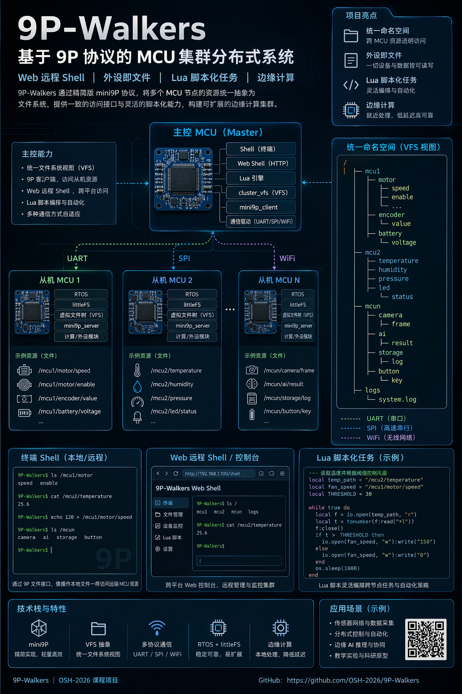

# 9P-Walkers

## Logo


## Poster



## 项目成员

- 董宇皓
- 霍斌
- 刘亦航
- 刘子源
- 武文韬

## 简介

本项目是中国科学技术大学 2026 春季学期 OSH-2026 课程小组 **9P Walkers** 的仓库，目标是实现一个面向异构 MCU 集群、基于 **Mini9P 协议** 的轻量级分布式系统。

### 核心构思

对于单个 MCU，现有 RTOS 已经相当成熟。我们将视野扩展到 **MCU 集群**：通过主控 MCU 连接多个从机 MCU，把文件、设备、诊断信息和计算服务组织到统一命名空间中，并通过脚本和 Web Shell 对集群进行交互与任务编排。

### 当前系统架构

```text
                         主机间 IP 平面
              mDNS + TCP/9909 + bounded CBOR RPC

    ESP32-P4 (Ethernet) <-----------------> ESP32-S3 (WiFi)
           |                                      |
           | UART 1 Mbaud                         | UART 1 Mbaud
           v                                      v
      STM32 子树                              STM32 子树
           \________ link v2 + mesh2 + data plane ________/

数据面:
  DATA_MINI9P  远端文件与诊断命名空间
  DATA_RPC     MCU unary/stream/oneway/cancel RPC
  DATA_JOB     可查询、取消、重试的计算任务
```

STM32 节点可以通过多个 UART 组成多跳拓扑。主机负责地址租约、拓扑维护和路由下发；节点维护端口状态、本地邻居和简化转发表。

### 主要功能

- **外设即文件**：通过 `/mcuN/...` 统一访问各节点的文件、状态和外设，并通过 `/host/sys/...` 查看主机运行状态。
- **Web 远程 Shell**：ESP32-P4 通过有线网络提供 WebShell，浏览器可直接执行集群命令。
- **脚本化任务**：主控内嵌 Lua，用于编排远端文件访问、设备控制和计算任务。
- **多跳组网**：支持端口发现、节点注册、地址租约、链路上报和集中式路由下发。
- **RPC 与 Job System**：支持 MCU unary、stream、oneway、cancel RPC，以及可查询、取消和重试的异步计算任务。
- **多主机协作**：P4 与 S3 通过 mDNS 发现和选主，实现全局节点命名、拓扑同步及跨主机读写。
- **分布式计算**：STM32 已实现 hash、vector add、matmul、Mandelbrot 和 raytrace tile kernel；P4 可用 Lua 将 smallpt 场景分片到多个 MCU，并由 F429 LCD 显示结果。
- **推理实验**：P4/S3 已接入本地 LLM 推理运行时和分布式推理服务骨架。

### 硬件组成

- ESP32-P4：有线网络主控、集群协调、WebShell、Lua 和任务调度。
- ESP32-S3：WiFi 主控、主机间协作和推理服务。
- STM32F407：FreeRTOS 计算与服务节点。
- STM32F429：计算节点及 240×320 LCD 显示端。

## 仓库目录

```text
pwos-shared/                 共享 link、mesh2、Mini9P、RPC、Job、Host RPC 和渲染协议
pwos-master-esp32p4/         P4 coordinator、WebShell、Host RPC、Lua 和推理
pwos-master-esp32s3/         S3 coordinator、WiFi、Host RPC 和推理
pwos-slave/                  STM32F407 FreeRTOS 节点
pwos-slave-stm32f429/        STM32F429 节点与 LCD
Lab4/                        Linux 分布式推理实验
docs/                        架构、协议、构建说明和历史记录
```

## 快速构建

```bash
# STM32F407
cmake --preset F407Debug -S pwos-slave
cmake --build pwos-slave/build/F407Debug

# STM32F429
cmake --preset Debug -S pwos-slave-stm32f429
cmake --build pwos-slave-stm32f429/build/Debug

# 导出 ESP-IDF 环境后构建主控
idf.py -C pwos-master-esp32p4 build
idf.py -C pwos-master-esp32s3 build
```

具体环境、构建与烧录步骤见[构建与烧录指南](docs/overview/build_and_flash.md)。

## 会议与项目进展记录

| 阶段 | 日期 | 进展 | 安排或成果 |
| --- | --- | --- | --- |
| 前期调研 | 3/9～3/15 | 各队员进行初步调研，收集选题 | 董宇皓：AIOS 安全管控；霍斌：MCU 集群上的分布式操作系统设计；刘亦航：Inferno 优化；武文韬：网络协议栈优化；刘子源：分布式文件系统设计 |
| 集中调研 | 3/16～3/20 | 各组员分别进行集中深入调研 | 汇总候选方向，为会议立项准备材料 |
| 会议立项 | 3/21 | 在会议中确定选题为 MCU 集群项目 | 初步确定实现路径，各组员分别调研和学习相关知识 |
| 会议讨论 | 4/2 | 讨论具体实现方案并确定初步分工 | 董宇皓：Slave 虚拟文件树、Mini9P server、驱动；霍斌：Mini9P client、通信层、协议；刘亦航：cluster VFS、调度器、Shell；刘子源：RTOS、计算模块；武文韬：Lua、Web Shell、文档报告 |
| 早期开发 | 4/3～4/15 | 搭建初步系统框架 | 推进主从工程、协议、VFS 和运行时原型 |
| 会议讨论 | 4/16 | 完成可行性分析报告 | 明确系统可行性与中期实现目标 |
| 中期开发与汇报 | 4/20～4/30 | 完成 Mini9P 初版、Lua Shell、基础文件命令和 Web Shell 原型；进行中期汇报 | 根据答辩意见继续完善协议、集群 VFS 与主从联调 |
| VFS 与从机服务 | 5/2～5/12 | 实现 cluster VFS 路径接口、Mini9P server、本地虚拟 VFS、UART transport；完成 STM32F411 迁移上板 | 形成动态节点注册、集群命名空间和多跳访问设计 |
| 集群功能整合 | 5/23～5/29 | 打通 Web Shell，接入 Lua VFS；完成 Mesh 协议、主机 runtime、动态节点管理和多 UART transport | 统一主从服务边界，推进多节点硬件联调 |
| 多跳路由联调 | 5/30～6/1 | 完成邻居探测、节点注册、链路状态上报、路由下发和 Mini9P 多跳访问 | PC emulator 与 STM32 上板验证通过，补齐架构和调试记录 |
| S3 与推理实验 | 6/1～6/10 | ESP32-S3 完成基础适配和小模型流式输入输出；`Lab4` 完成双 Linux 节点分布式推理实验 | 同期推进 RPC、自动 UART 配置和 Web Shell 网络适配 |
| 通信栈重构与全系统联调 | 6/16～6/30 | 完成 link v2、FreeRTOS DMA/IDLE、多端口控制面、并发 Mini9P、RPC、Job System、Host RPC 与多主机协作 | 清理旧实现，完成 PC 测试和阶段验收记录 |
| 期末报告 | 7/2 | 整理最终答辩材料 | 汇总最终架构、构建说明和后续演进边界 |

原始会议纪要、调研报告和逐日开发日志保存在 [`docs/logs/`](docs/logs/)，重构阶段的详细验收记录见[里程碑日志](docs/logs/refactor/README.md)。

## 相关文档

- [系统架构](docs/overview/architecture.md)
- [协议规范](docs/overview/protocol_spec.md)
- [链路与 UART 运行时](docs/overview/transport_abstraction.md)
- [主机网络与多主机](docs/overview/host_network.md)
- [从机运行时](docs/overview/slave_mesh_runtime.md)
- [重构完成记录](docs/overview/refactor_plan.md)
- [构建与烧录指南](docs/overview/build_and_flash.md)
