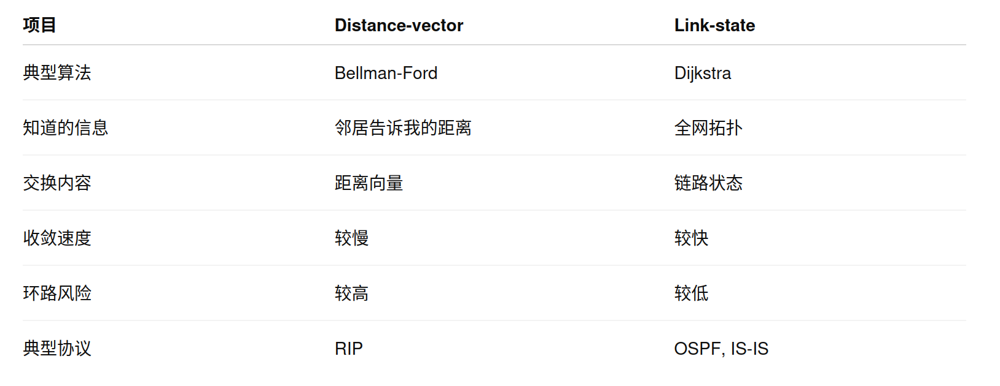

# TODO

## Mini9P 多 UART 与共享 backend 串行化

- 当前 `mesh_node_service` 默认安全前提是单 UART、单 `m9p_server`、单线程轮询访问 backend。
- 如果未来多个 UART/service 同时访问同一个 `node_vfs/lfs_vfs/dev_vfs`，需要引入 backend 串行化机制。
- 推荐方向：每条 UART 保持独立 `m9p_server/mesh_node_runtime/transport`，共享 backend 通过单 backend worker 队列串行处理。
- `mesh_node_service_backend` 当前可注入 worker proxy ops，但它本身不提供队列、锁、超时或取消语义。
- 后续可把 `uart` 从 `mesh_node_service_backend` 拆到 `mesh_node_service_config`，让 backend 注入和 transport 配置职责分离。

## STM32 多 UART RX 异步化

- 当前 `rx_pending + poll_once` 是短期止血方案：它避免从机在空 UART 上阻塞读 200ms，已经足够支撑低流量 `PC <-> A <-> B` 上板联调。
- 后续需要把 STM32 mesh UART RX 改成异步接收，推荐方向是 `HAL_UARTEx_ReceiveToIdle_DMA()` 或 circular DMA + IDLE IRQ。
- TX 先保留当前阻塞发送；RX 稳定后再评估是否需要 TX DMA。
- DMA/IRQ callback 只负责把收到的字节推进每个 UART port 的 ring buffer 或 frame queue，不解析 mesh frame，不调用 `mesh_node_runtime_*()`。
- `mesh_node_service_poll_once()` / `mesh_node_runtime_poll_once()` 保留；它们后续从内存 ring/frame queue 消费完整帧，而不是直接对 HAL UART 做阻塞读。
- `mesh_uart_transport_rx_pending()` 保留为 transport 抽象；DMA 化后语义改成“ring buffer 或完整帧队列是否有待处理数据”。
- 需要改动的区域：
  - F407/F411 板级 USART DMA/NVIC 配置。
  - `mesh_uart_transport` 增加 per-port RX ring buffer、IDLE/DMA 事件接入和完整帧解析。
  - `mesh_node_service_receive_frame()` 消费完整帧并继续返回真实 ingress port。
  - PC/stub 测试覆盖“没有完整帧时返回 `-MESH_ERR_BUSY`”。
- 验收场景：
  - 单板 `PC <-> F407` 注册、probe、LINK_STATE、attach 成功。
  - 串联 `PC <-> A <-> B` 完成 B 注册、ASSIGN 回转、双方 LINK_STATE、ROUTE_UPDATE、小 mini9P 请求。
  - A 同时从上游和下游收到短控制帧时不丢 probe response。

## 备选：邻居传播路由模型

- 当前路由策略先保持“控制器下发指定路由”：主机/控制器计算或指定 `dst -> next_hop -> metric`，节点只应用收到的路由更新。
- 后续可评估邻居传播模型：每个节点周期或触发式向直连邻居广播自己的可达表，接收方用“邻居宣告 metric + 1”与本地路由表比较，选择更优路由。
- 在该模型里，接收方的 `next_hop` 应该是宣告该路由的邻居地址，也就是入站控制帧的 `src`；不应直接信任 payload 里的 `next_hop`，否则会把邻居内部路径误当成本机下一跳。
- `addr -> port` 映射可以由入站端口学习，但应优先从直连邻居控制帧学习，不能简单用普通转发数据帧的原始 `src` 推断直连关系。
- 需要处理 count-to-infinity/环路收敛问题：metric 会增大但不代表立刻无环，需要设置最大 metric、路由老化、版本/序列号、split horizon 或 poison reverse。
- 如果以后实现，建议新增“route advertise”语义，避免和现有“控制器指定 route update”混用。

##  **拓扑有向**
- 目前`收到 `A → B` 不自动补 `B → A`；反向路径必须由 B自行上报 LINK_STATE
- 考虑将来：主机直接把这样的链路视做双向连通
