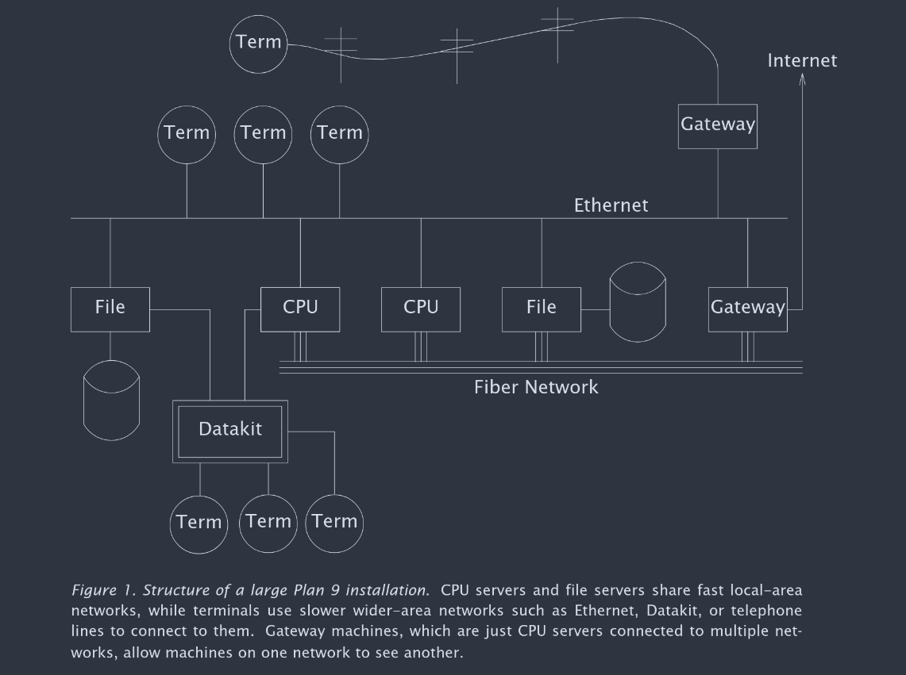
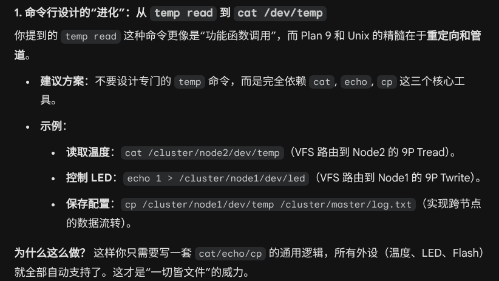
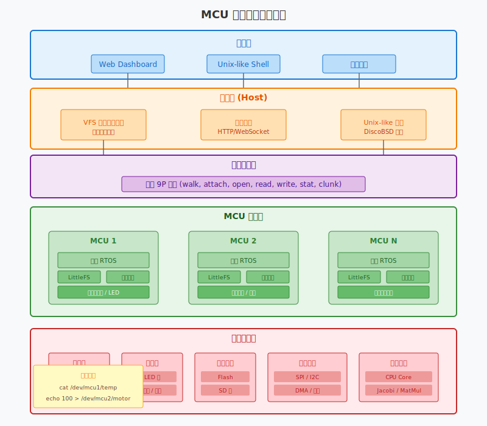

## Plan 9
Plan 9 是贝尔实验室开发的操作系统

分布式系统，将系统拆分为 CPU、Files、Terminal三部分，实现功能的解耦，设想是一个高性能的中心服务器，用户使用低性能的终端设备访问使用服务器

通过 9P 协议实现各种设备统一化，通过统一 Namespace 使得系统更透明。

Plan 9 的设计理念是将所有设备和数据都表示为文件，包括网络、进程、用户界面等。

ftpfs，直接把 FTP 服务器上的文件系统挂载到本地，用户可以像访问本地文件一样访问远程FTP服务器上的文件。

exportfs，可以把网络发来的 9P 请求翻译到本地系统执行，这样就可以让外部系统直接访问本地系统，甚至可以直接挂载进程，轻松远程调试。

事实上，有很多系统都基于 9P 协议实现，比如 WSL，QUME等。

## LittleFS

LittleFS 是一个专门在 microcontroller 上运行的文件系统。

## VFS

VFS 是 Virtual File System 的缩写，虚拟文件系统，是一个抽象层，提供统一的接口来访问不同类型的文件系统。可以让用户在不关心底层文件系统细节的情况下访问文件。

可以在多个 MCU 上运行各自的文件系统，然后 VFS 统一管理这些文件系统，然后使用 9P 协议来访问和管理这些文件系统。这样就可以实现分布式文件系统，用户可以通过网络访问不同 MCU 上的文件系统和外设，就像访问本地文件一样。

## RT-Thread

RTT 其实已经实现了对外设的统一访问接口，不过他是在单机上运行的，可以参考其 DFS 模块的设计来实现多机上的系统。

## DiscoBSD

DiscoBSD 在单个 MCU 上实现了几乎完整的 Unix-like 系统功能，参考其设计可以在系统顶层提供一个 Unix-like 的接口。

## Atomthreads

一个非常乞丐版的实时系统，所有文件一共就几个 ANSI C文件，参考这个自研一个垃圾系统来管理文件系统和外设的接口，提供给用户态访问。

## 总结
总结一下，对于单机，还需要在每个 MCU 上实现小型的实时系统，提供管理文件系统和外设的接口，可以考虑自研一个乞丐版的小家伙（参考 Atomthreads）来实现这个功能。用这个东西来管理单个 MCU。对于多个 MCU，每个 MCU 上运行一个轻量级文件系统(LittleFS)，通过 VFS 统一到主机上， 主机通过 9P 协议访问和管理这些文件系统和外设，通过微服务器暴露到网络上，用户通过 Web 页面的 shell (Disco BSD) 或 dashboard 来访问和管理这些文件系统和外设。

---
9P 协议在多机通信间主要需实现一下几个功能：
- walk: 在文件系统中导航，找到目标文件或目录
- attach: 建立连接
- clunk: 关闭连接
- open: 打开一个文件，获取一个文件句柄
- read: 从文件中读取数据
- write: 向文件中写入数据
- stat: 获取文件或目录的状态信息
- Tag: 用于标识请求和响应的唯一标识符，应对并发请求
- error handling: 处理错误情况
- auth: 权限校验
- flush: 取消一个正在进行的请求
- 文件分片: 处理大文件传输

考虑到难度，error handling 只需实现最简单的错误处理，auth 直接放弃，做个最简单的用户态和内核态的权限校验就行，flush 也可以先不实现，因为请求基本都是一瞬间完成的，文件分片有点复杂，文件分片之后还得超级拼装，要考虑可能的丢包和乱序等问题，直接把一个文件的大小限制死，以后再说。

---
参考 9P 协议的帧结构，设计一个更精简的协议就行。

对于每一个外设，都需要单独写对应的 read 和 write 函数来处理，比如对于一个温度传感器，read 函数可能会读取传感器的数据并返回，而 write 函数可能会设置传感器的参数；如果是一个 LED 灯，read 函数可能会返回当前的状态，而 write 函数可能会改变 LED 的状态。

这些 read 和 write 函数再封装一层，提供给用户态接口，设计一套对应 bash 的命令行工具来访问这些接口，比如对于温度传感器，可以设计一个命令 `temp read` 来读取温度数据，`temp set` 来设置传感器参数；对于 LED 灯，可以设计 `led read` 来读取当前状态，`led set on` 来打开 LED，`led set off` 来关闭 LED。

进一步的，对于每个 Flash/SD 卡等存储设备，可以设计一个命令 `storage read` 来读取数据，`storage write` 来写入数据，`storage format` 来格式化设备等。

并行计算的话，因为实现通用的任务调度过于复杂，可以先搞一些特定的任务，比如算个 Jacobi 迭代，或者矩阵乘法等，设计一个命令 `compute jacobi` 来执行 Jacobi 迭代，`compute matmul` 来执行矩阵乘法等。

### 团队分工安排（5人梯队版：2高经验 + 1中经验 + 2偏新手）

结合项目**“基于微控制器集群的边缘计算分布式操作系统”**极高的复杂度和 5 人队伍的经验分布，建议采用**“硬骨头老手主导、中段承上启下、应用与前端给新手练手”**的分层架构：

#### 1. 核心内核与 VFS 架构（适合：经验丰富者 A）
**定位：项目架构的“主心骨”，难度与底层容错率要求极高。**
*   **自研轻量级 RTOS：** 参考 Atomthreads 实现最关键的任务调度抢占、上下文切换与内存锁机制。
*   **VFS 核心实现：** 开发虚拟文件系统路由层，实现统一的命名空间（Namespace），将应用层 POSIX 接口（open/read/write）无缝分发给本地硬件或网络协议。
*   **系统调用设计：** 划分用户态与内核态边界（如需），打通底层到应用的 Syscall。

#### 2. 分布式通信与微服务网关（适合：经验丰富者 B）
**定位：系统的“神经中枢”，涉及跨物理节点通信，并发与丢包处理极其考验功底。**
*   **9P 协议核心引擎：** 简化并实现 9P 协议，负责二进制包的构建、解析以及 RPC 远程资源映射。
*   **分布式统筹中心：** 在主控端设计简单的任务调度分发队列（应对多计算任务下发给群组 MCU）。
*   **微服务 API 网关：** 在具备网络的主控（如 ESP32）上部署轻量 HTTP/WebSocket Server，将网络请求转化为 VFS 查询。

#### 3. 底层驱动与硬件抽象层（适合：经验中等者）
**定位：连接物理环境的“苦力活”，需要耐心看 Datasheet 和调通信总线，属于标准嵌入式开发。**
*   **底层通信链路建立：** 跑通多机间的 UART/CAN/SPI 及 DMA，为高级的 9P 协议提供底层数据传输 `send()`/`recv()` 的通道。
*   **外设文件化接口：** 将各个传感器（温湿度）、执行器（LED、电机）逻辑按照 VFS 的规范封装成标准的读写接口，提供挂载点。
*   **存储引擎移植：** 负责将 LittleFS 运行在 MCU 上，实现 Flash 层的擦写适配与掉电保护。

#### 4. 用户态 Shell 与并行应用（适合：经验较少者 A）
**定位：站在 OS 巨人的肩膀上做开发，只需关注 C 逻辑，是深入理解整个操作系统抽象的最佳切入点。**
*   **命令行交互环境：** 设计 Shell 交互解析器，实现诸如 `ls`, `cat /dev/temp`, `echo 100 > /dev/motor` 等标准调试指令指令。
*   **并行计算应用研发：** 使用 C 语言编写上层并行计算 Demo（如 Jacobi 迭代或矩阵分解），测试主机通过文件系统读写来分发计算块。

#### 5. Web 前端与状态可视化（适合：经验较少者 B）
**定位：完全与底层 C、硬件解耦，纯软件思维开发，产出视觉效果好，极其适合用来最终汇报展示。**
*   **集群 Dashboard 开发：** 基于纯 HTM/JS 编写响应式网页 UI，展示集群树状拓扑图。
*   **接口轮询与渲染：** 通过向微服务器发送 HTTP/WebSocket 协议，拉取各外设的数据和各节点的计算进度曲线，绘制实时动态图表。

> **多阶段协作解耦：**
> - **阶段一：** 当丰富 A 的调度器没写完时，丰富 B 测试 9P 可用 Linux 下的 Mock 数据，中等者独立在裸机调驱动。
> - **阶段二：** 较少者 A 可以在 Linux 写应用逻辑，较少者 B 可基于假数据跑通 Web 前端。
> - **最终联调：** 所有代码向 VFS 与 9P 协议的两套 API 收拢，串联整个链路。

> **协作解耦点：** 
> * 模块 1 和 模块 2 通过 **VFS 层** 和 **HAL 层** 接口对接；
> * 模块 1 和 模块 3/4 通过 **9P 协议** 和 **系统调用 (Syscall)** 对接。
> * **推介执行流程：** 单机 RTOS 跑通 -> 外设文件化 -> 9P 协议多机互联 -> Web 可视化及并行应用部署。

我现在做了一些调研，我看了一下Plan 9 的设计，想参考9P协议设计一个MCU上的分布式系统，把存储、运算、和终端之类的任务分开，把所有外设映射成文件统一管理。首先设计一个简化的9P协议来实现通信，然后在每个MCU上设计简单的任务调度和文件系统，单个MCU跑起来之后再把多个MCU通过9P协议连接起来，主机上设计一个Unixlike的系统，通过VFS把所有节点挂载到一起，然后搞一个微服务器到web页面上，在web上搞一个shell作为系统的入口，比如我要获取一个温度传感器的数据直接在shell里输入 cat /dev/mcu1/temp，如果要控制电机速度就输入 echo 100 > /dev/mcu2/motor1/speed。或者可以在这个系统上跑一些特定的计算任务，通用的并行计算调度好像太复杂了，所以可以实现一些特定的任务，比如算一个Jacobi迭代之类的

