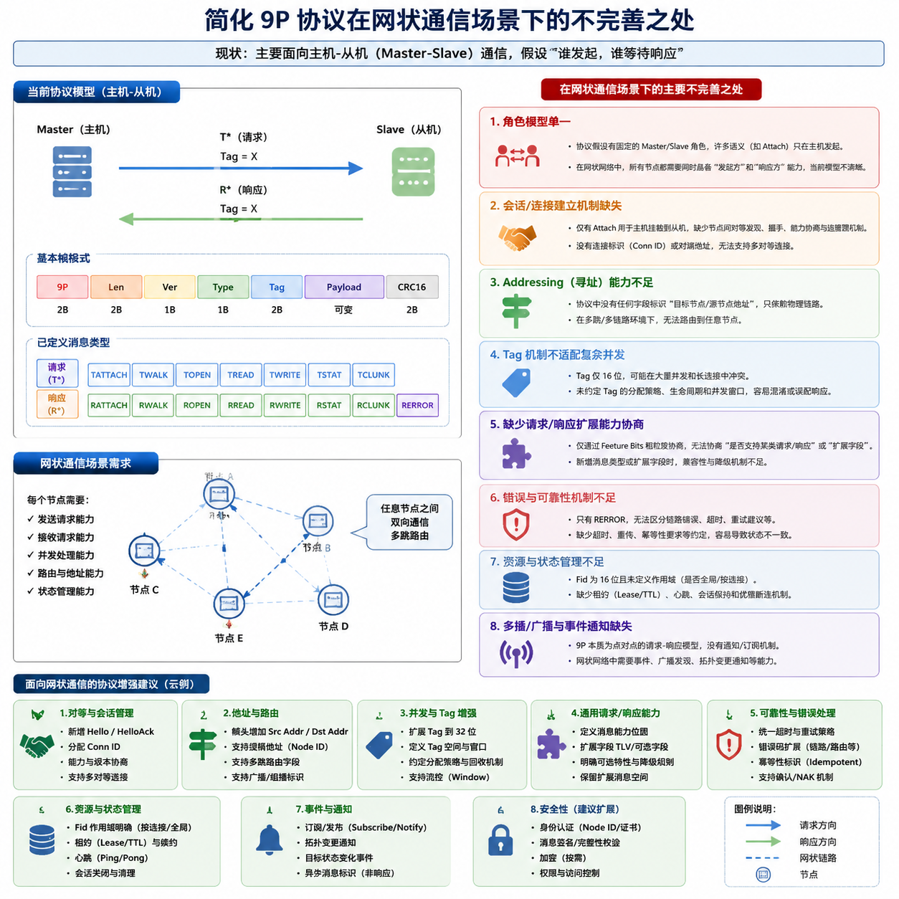

我仔细分析了你们提供的 mini9p 协议实现（`mini9p_protocol.h` + `mini9p_protocol.c`），它是一个典型的主-从、请求-响应模式协议，针对主机发起请求、从机返回响应进行了简化设计。现在如果想扩展成网状通信（Mesh），也就是节点既能发起请求也能接收请求，存在一些天然的不完善之处：

---

### 1️⃣ 请求/响应模式过于严格绑定主/从角色

* 现有设计假设：

  * 主机（Master）发起 `T*` 请求。
  * 从机（Slave）返回 `R*` 响应。
* 网状网络中，每个节点可能同时是“主”和“从”，但协议里 `T*` 和 `R*` 的角色是硬编码的。
* **问题**：

  * 无法自然支持节点 A 向节点 B 发请求，同时节点 B 也可以向 A 发请求。
  * tag/事务管理仅针对单向请求设计（Master 管理标签），缺少双向并发管理。

---

### 2️⃣ 标签管理（tag）限制

* `tag` 用于匹配请求与响应：

  ```c
  out_view->tag = get_le16(frame + 6); // 解析
  put_le16(out_frame + 6, tag);        // 编码
  ```
* 目前假定标签由 Master 分配，并且从机不会发起新请求。
* **问题**：

  * 双向请求时，每个节点都需要独立管理标签，避免冲突。
  * 当前协议没有定义 tag 范围、循环或重用策略。

---

### 3️⃣ 流控与并发（inflight）仅限 attach

* 现有：

  ```c
  out_request->requested_inflight // TATTACH 请求
  out_result->max_inflight        // RATTACH 响应
  ```
* **问题**：

  * 只有在 attach 时控制最大未完成请求数。
  * 网状通信可能同时有多个节点发起请求，单次 attach 设置无法动态调整。
  * 没有提供全局流控或拥塞控制机制。

---

### 4️⃣ 功能位和扩展性有限

* `feature_bits` 仅在 RATTACH 中定义：

  ```c
  #define M9P_FEATURE_MULTI_TAG 0x00000002u
  ```
* **问题**：

  * 节点之间无法协商是否支持主动请求或双向通信。
  * 不支持动态能力发现或版本兼容。

---

### 5️⃣ 帧结构简单但缺少路由信息

* 帧头只包含：

  ```c
  '9','P', length, version, type, tag
  ```
* **问题**：

  * 对于网状网络，可能需要：

    * 源节点 ID / 目标节点 ID
    * 路径或中继信息
  * 现有帧无法区分来自不同节点的请求，也不方便广播/转发。

---

### 6️⃣ 错误处理局限

* 错误响应 (`RERROR`) 是针对请求的：

  ```c
  uint16_t code;
  char msg[M9P_MAX_ERROR_TEXT + 1];
  ```
* **问题**：

  * 双向请求中，如果节点主动发起请求失败，RERROR 与原始 tag 匹配可能存在歧义。
  * 没有区分本地错误 vs 转发错误。

---

### 7️⃣ 数据大小和帧长度限制

* `payload_len` 最大 65535-4 字节。
* `TWRITE` 限制写数据最多 256 字节：

  ```c
  if (count > 256u) return false;
  ```
* **问题**：

  * 网状网络节点间传输大数据可能受限。
  * 多跳传输中需要拆包和重组，但协议没有定义拆包机制。

---

### 8️⃣ 没有天然的异步支持

* 现有协议是同步 request/response：

  * Master 发请求后等待响应。
  * Slave 回复响应。
* **问题**：

  * 网状通信中可能同时接收多个请求。
  * 当前协议没有异步通知或事件机制。
  * 不适合需要推送消息或广播的场景。

---

### 9️⃣ 缺少节点身份管理

* 没有节点 ID、会话 ID 或安全认证机制。
* 网状网络中可能出现：

  * 请求来自未知节点
  * 重复请求或环路请求
* 现协议无法区分不同节点来源。

---

### ✅ 总结

简化的 9P 协议适合单主机场景，但在网状通信场景下，主要短板包括：

| 问题       | 原因                        | 对网状通信影响       |
| -------- | ------------------------- | ------------- |
| 主从角色硬编码  | T* 请求只由 Master 发          | 无法自然支持双向请求    |
| 标签冲突     | 标签由 Master 管理             | 双向请求可能 tag 冲突 |
| 并发控制局限   | inflight 只在 attach 时设置    | 无法动态控制多节点并发   |
| 功能位和协商有限 | feature_bits 仅 attach 时协商 | 无法协商双向能力      |
| 缺少节点信息   | 帧头不含源/目的节点 ID             | 无法区分请求来源或路由   |
| 错误响应绑定请求 | RERROR 仅针对 tag            | 双向请求错误可能歧义    |
| 数据长度限制   | TWRITE 最大 256B            | 网状网络传输大数据困难   |
| 同步模式     | 请求-响应绑定                   | 无法处理异步或广播消息   |
| 无身份或安全   | 无节点 ID / 认证               | 易产生冲突或欺骗      |

---

如果你希望，我可以帮你画一张图，展示这个协议改造为网状通信时的改动点，包括双向请求、tag 管理、节点 ID 和帧结构扩展，方便团队讨论。

你希望我画这个图吗？
