# 9P-Walkers 期末报告

> **中国科学技术大学 2026 春季学期 OSH-2026 课程大作业**
>
> **小组成员**：董宇皓、霍斌、刘亦航、刘子源、武文韬
>
> **日期**：2026-07-08

---

## 目录

1. [项目概述](#1-项目概述)
2. [系统最终设计](#2-系统最终设计)
   - 2.1 [整体架构](#21-整体架构)
   - 2.2 [STM32 从机平面](#22-stm32-从机平面)
   - 2.3 [ESP32 主机内部设计](#23-esp32-主机内部设计)
   - 2.4 [主机间 IP 平面](#24-主机间-ip-平面)
   - 2.5 [协议栈设计](#25-协议栈设计)
   - 2.6 [分布式计算系统](#26-分布式计算系统)
   - 2.7 [LLM 推理引擎](#27-llm-推理引擎)
   - 2.8 [渲染与显示系统](#28-渲染与显示系统)
   - 2.9 [WebShell 与可观测性](#29-webshell-与可观测性)
3. [测试与分析](#3-测试与分析)
   - 3.1 [PC 单元测试覆盖](#31-pc-单元测试覆盖)
   - 3.2 [里程碑验收测试](#32-里程碑验收测试)
   - 3.3 [上板集成测试](#33-上板集成测试)
   - 3.4 [资源占用分析](#34-资源占用分析)
   - 3.5 [故障注入与可靠性测试](#35-故障注入与可靠性测试)
   - 3.6 [LLM 推理系统安全审计](#36-llm-推理系统安全审计)
   - 3.7 [性能分析](#37-性能分析)
4. [总结与展望](#4-总结与展望)

---

## 1. 项目概述

9P-Walkers 是一个面向异构 MCU 集群的轻量级分布式实时操作系统原型。项目以 ESP32-P4
和 ESP32-S3 作为主控节点（Host），以 STM32F407 和 STM32F429 作为从机节点（Slave），
通过 UART 物理链路和自定义轻量协议栈，将多个 MCU 组织为一个统一命名空间下的分布式系统。

**核心设计理念**源自 Plan 9 操作系统的"一切皆文件"思想：将外设状态、诊断信息、计算
能力统一抽象为文件，通过 mini9P 远程文件协议实现跨节点透明访问。用户最终面对的是
`/mcuN/...` 形式的统一路径，而非分散的设备寄存器或专用控制接口。

**主要功能特性**：

- **统一命名空间**：通过 `cluster_vfs` 将多个从机的文件树挂载到 `/mcuN/...` 路径下
- **mini9P 远程文件协议**：支持 attach、walk、open、read、write、stat、clunk 七种基本操作
- **MCU RPC**：支持 unary 调用、streaming、oneway 通知、cancel 和 deadline 超时
- **异步 Job System**：支持 hash、vector add、matmul、Mandelbrot、smallpt 光线追踪
- **分布式光线追踪渲染**：P4 Lua 调度器将 240×320 场景拆分为 tile 分发给多个 STM32 并行计算
- **本地 LLM 推理**：基于 llama2.c 移植的 Transformer 推理引擎，运行在 ESP32-S3/ESP32-P4 上
- **多主机协同**：ESP32-P4 (Ethernet) 与 ESP32-S3 (WiFi) 通过 host RPC 实现跨主机节点访问
- **WebShell**：基于 HTTP/WebSocket 的远程命令行交互界面
- **故障注入与可观测性**：完整的 `/sys` 诊断命名空间、运行时统计和 Debug 故障注入

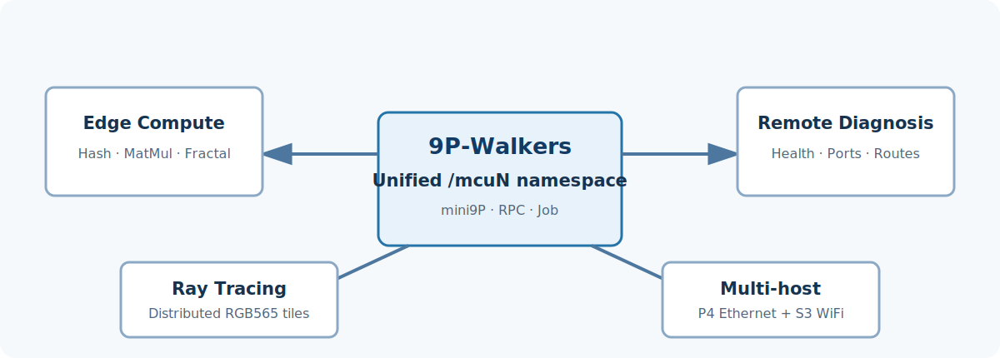

---

## 2. 系统最终设计

### 2.1 整体架构

系统包含两个相互独立、只在 ESP32 主机汇合的网络平面：

```text
┌────────────────── 主机间 IP 平面 ──────────────────┐
│  ESP32-P4 (Ethernet)  <-->  router  <-->  ESP32-S3 (WiFi)  │
│  mDNS discovery + TCP/9909 + bounded CBOR host RPC          │
└─────────────────┬─────────────────────┬─────────────────────┘
                  │ UART 1 Mbaud        │ UART 1 Mbaud
┌─────────────────▼─────────────────────▼─────────────────────┐
│                 STM32 有线 mesh 平面                         │
│    link frame v2 + mesh2 control + typed data plane         │
│    节点可作为 relay，支持多 UART、多跳转发                    │
└─────────────────────────────────────────────────────────────┘
```

**关键设计决策**：

1. **逻辑中心式、物理链路可演进**：主机维护全局命名空间和拓扑，STM32 仅保存本地转发表，
   不运行全局路由算法。物理上支持链式多跳中继，但命名空间主导权始终在主机侧。

2. **两平面隔离**：主机间不透传 STM32 link frame。跨主机访问由 owner 主机终止 host RPC，
   再在自己的 STM32 子树中发起 mini9P/RPC/Job 请求。

3. **热路径零动态分配**：所有协议帧、队列、Job 槽位均使用固定上限的静态内存，避免
   MCU 环境下的内存碎片化和分配延迟。

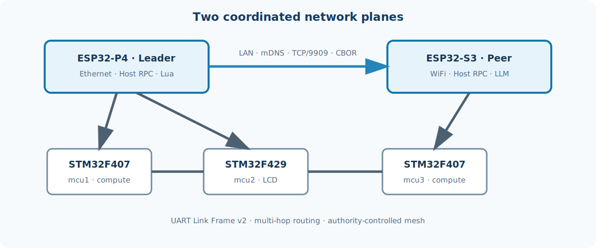

**系统启动流程**：ESP32 主机与 STM32 从机并行启动，主机依次完成芯片初始化、Coordinator Runtime、网络服务和用户服务；从机依次完成 HAL 外设初始化、FreeRTOS 对象创建和调度器启动。

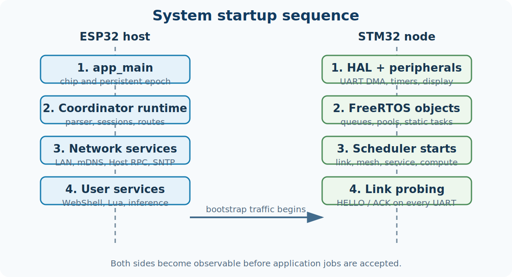

### 2.2 STM32 从机平面

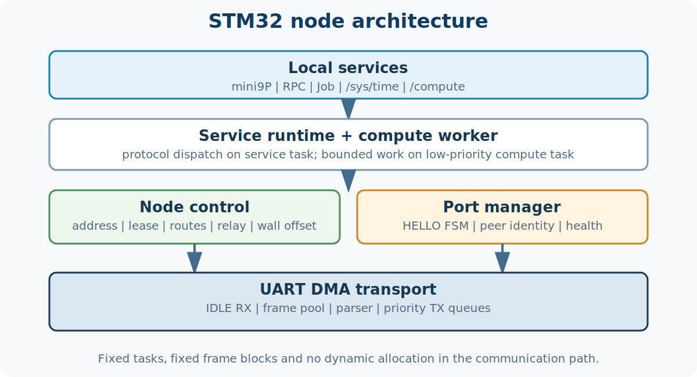

#### 2.2.1 任务架构

STM32 节点（F407/F429）运行 FreeRTOS，采用严格分层的任务流水线：

```text
UART DMA callback (ISR)
  --> link_rx queue
  --> link_rx_task         (优先级: 高)
       --> port_manager    (HELLO FSM、peer 身份管理)
       --> mesh_rx queue
  --> mesh_ctrl_task       (优先级: 高)
       --> node_control    (地址、lease、路由、中继转发)
       --> service_rx queue
  --> service_task         (优先级: 中)
       --> mini9P server   --> local_vfs
       --> rpc_service
       --> job_service     --> compute_worker
  --> compute_task         (优先级: 低)
       --> compute_worker  (增量 kernel 执行)

ctrl_tx / link_tx queue --> link_tx_task --> UART DMA TX
```

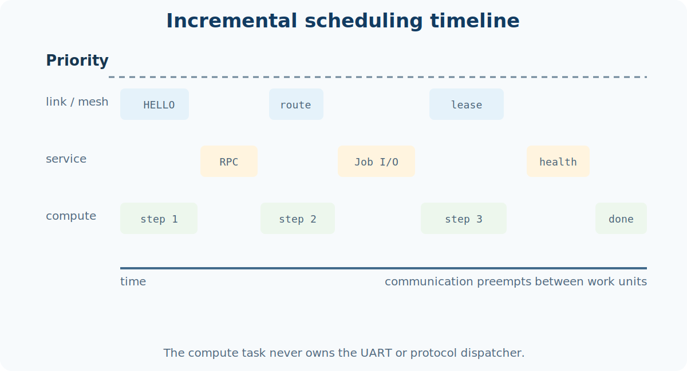

**关键不变量**：

- ISR 只搬运字节、更新 DMA 状态并通知任务，不执行任何协议逻辑
- UART RX 只有 `link_rx_task` 一个消费者
- 控制队列（ctrl_tx）优先于数据队列（link_tx）
- `service_task` 只做短时协议解析，不等待 compute 完成，因此 HELLO、lease、route 等
  控制面在计算期间不受影响
- 任一端口错误不能停止其他端口
- 帧块入队成功后所有权转移，所有失败路径必须归还块

#### 2.2.2 控制面 Bootstrap

节点启动后的自组网流程：

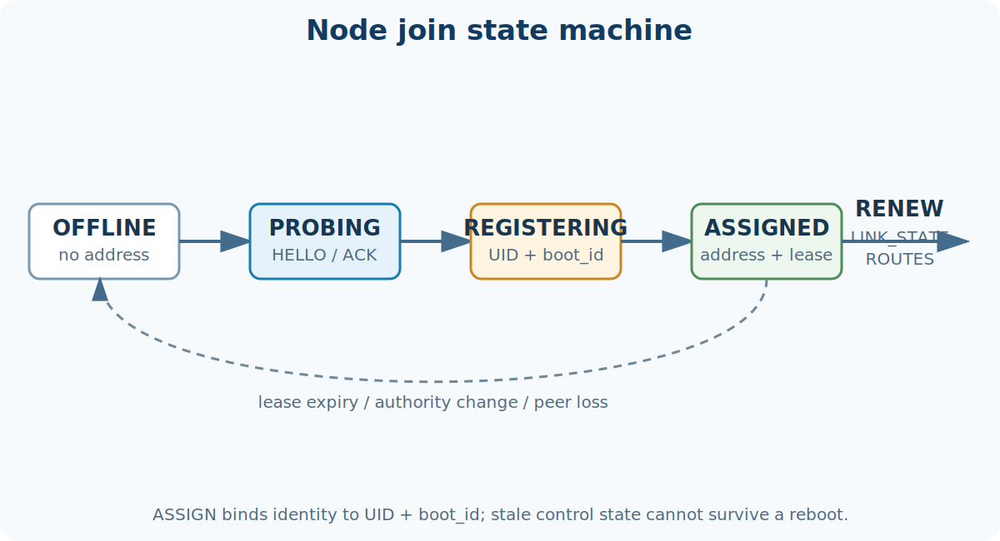

1. 各端口周期发送 `LINK_HELLO`，携带 UID（3 字节硬件标识）、boot_id、port_id 和 capability
2. 收到 `LINK_HELLO_ACK` 后，端口进入 PEER 或 HOST_CANDIDATE 状态
3. 未分配节点选择 coordinator（直连主机）或可到达 upstream 的 relay peer
4. 通过 `CTRL_NODE_REGISTER` 注册（可由 relay 向上游转发）
5. Coordinator 返回 `CTRL_ADDR_ASSIGN`，分配短地址和 lease 有效期
6. 节点周期上报 `CTRL_LINK_STATE`（邻接关系和链路质量）
7. Coordinator 计算全局拓扑，下发带 version 的 `CTRL_ROUTE_UPDATE`
8. 节点进入 lease 续期循环

**安全约束**：节点只接受当前 authority/upstream 的控制指令；旧 route version 不得覆盖
新版本；boot ID 改变后所有旧状态（session、fid、RPC pending、Job）全部失效。

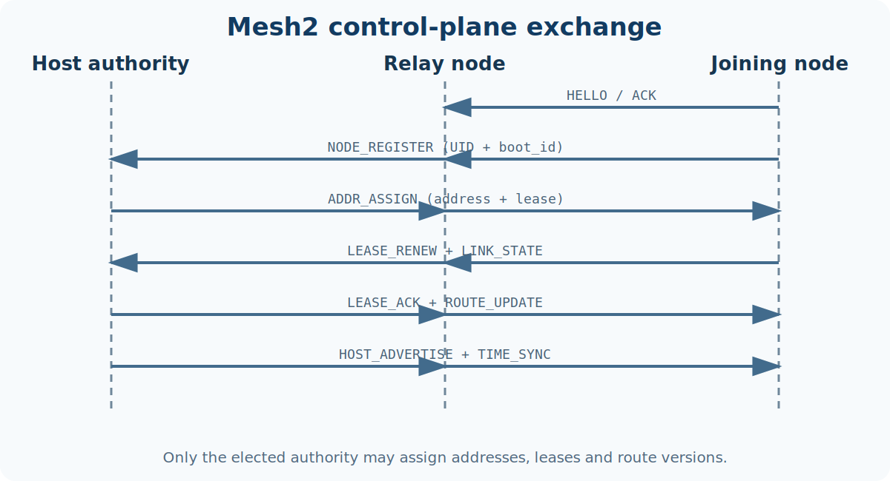

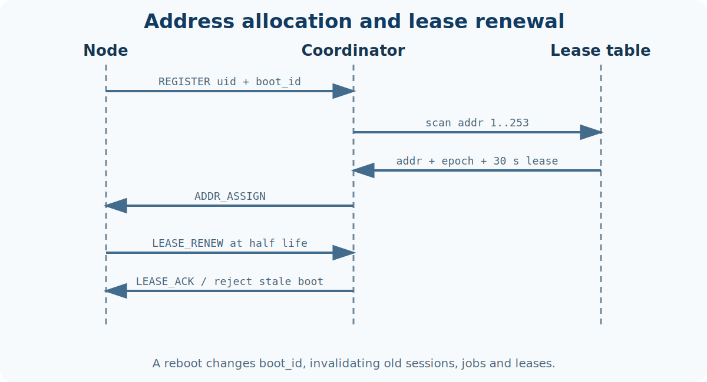

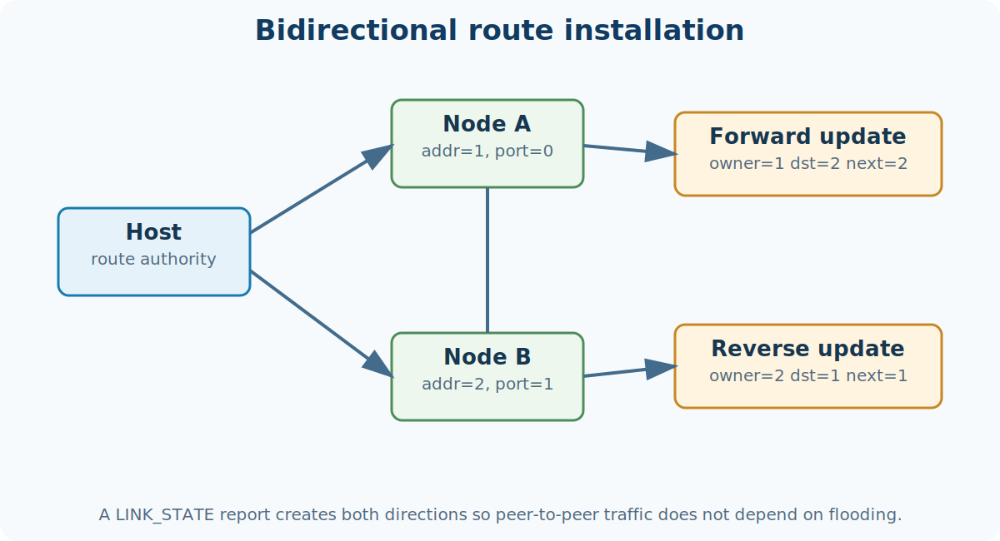

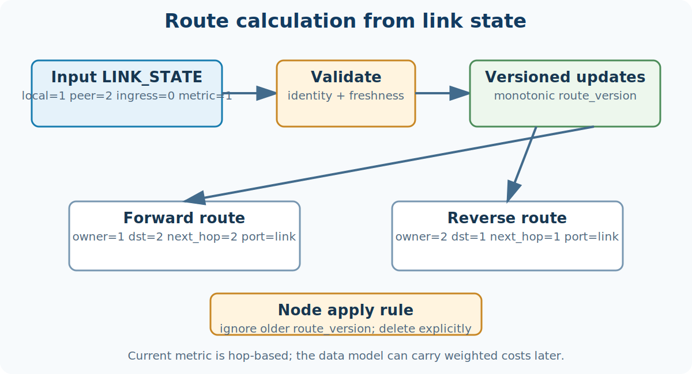

#### 2.2.3 本地命名空间

```
/sys/
  health      只读  节点综合健康状态
  tasks       只读  各 FreeRTOS 任务的 heartbeat 和 stack watermark
  ports       只读  UART DMA 统计（rx/tx bytes, frames, errors）
  links       只读  直连 peer 列表
  neighbors   只读  邻居节点信息
  routes      只读  当前本地转发表
  sessions    只读  活跃 session 统计
  queues      只读  frame pool 使用率和高水位
  log         只读  最近日志
  build       只读  固件版本和构建时间
  fault       读写  Debug 故障注入控制（仅 Debug 构建）
  info        只读  节点 UID、boot_id、地址
  uart        只读  各 UART 端口详细统计

/compute/
  caps        只读  支持的 kernel 列表
  load        只读  当前计算负载
  jobs        只读  活跃 job 列表

/display/     仅 F429
  status      只读  显示屏状态
  tile        只写  写入 tile 像素数据（RGB565）
```

#### 2.2.4 模块所有权

| 模块 | 职责 | 所属状态 |
|------|------|----------|
| `uart_dma_port` | HAL UART/DMA、parser、rearm、TX complete、硬件统计 | 各物理端口 |
| `frame_pool` | 固定大小帧块的生命周期管理 | 全局 |
| `port_manager` | HELLO FSM、peer UID/boot/capability、端口健康 | 各物理端口 |
| `node_control` | 本机地址、lease、authority、route、relay 和数据转发 | 全局 |
| `service_runtime` | typed data 分发、mini9P server | 全局 |
| `rpc_service` | MCU RPC 方法和延期/流式调用状态 | 全局 |
| `job_service` | 远端 job 协议、静态 job 槽管理 | 全局 |
| `compute_worker` | 低优先级增量 kernel 执行 | 全局 |
| `local_vfs` | 路径解析、权限检查、qid 分配、运行时文本回调 | 全局 |
| `fault_control` | Debug 故障注入（丢包/损坏/延迟/端口down/recover） | 全局 |

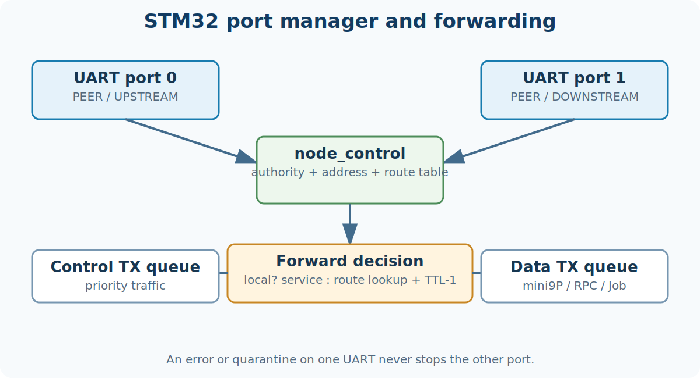

### 2.3 ESP32 主机内部设计

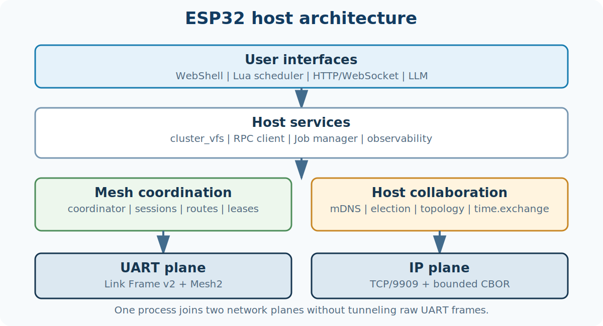

#### 2.3.1 主机分层架构

```text
UART RX task (唯一消费者)
  --> coordinator_runtime
       --> host_coordinator      地址分配、lease 管理、拓扑维护、路由计算
       --> session_manager       typed pending、全局 tag 分配、deadline 管理
       --> cluster_vfs           /mcuN 路径映射、fid 管理、generation 版本
       --> slave_rpc             DATA_RPC 客户端
       --> job_manager           DATA_JOB 生命周期管理

WebShell / Lua / inference
  --> host_shell / host_api / host_jobs
  --> 上述主机服务（通过回调接口）
```

**ESP32-P4 特有功能**：Ethernet (IP101 PHY)、HTTP Server、WebSocket、Lua 渲染调度器、
LLM 推理引擎、host RPC server/client。

**ESP32-S3 特有功能**：WiFi STA、LLM 推理引擎（主要运行平台）、host RPC client。

**共享模块**：coordinator_runtime、host_coordinator、session_manager、slave_rpc、
job_manager、cluster_vfs、host_shell 等通过编译宏在 P4/S3 间复用。

#### 2.3.2 Coordinator Runtime

Coordinator 是主机侧最核心的模块，负责：

- **UART 驱动**：初始化 ESP-IDF UART driver，单一 RX task 消费字节流
- **Link Parser**：驱动 `pwos_link_parser` 增量解析帧
- **控制帧处理**：在同一任务中处理 HELLO、REGISTER、LINK_STATE 等控制帧
- **Typed Data 分发**：按 `(data_type, src_addr, tag)` 匹配 pending，唤醒等待者
- **TX 互斥**：使用 mutex 和帧间 guard 防止多上层并发写交错

**关键设计约束**：

- UART RX 只有一个消费者，请求发起方通过 session manager 的 semaphore 等待结果
- 控制队列优先于数据队列
- 不直接在 UART RX task 中执行用户回调

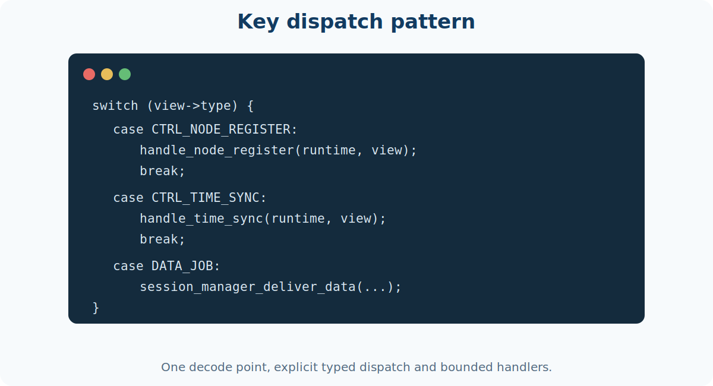

#### 2.3.3 Session Manager

Session Manager 实现 typed pending 机制：

- Pending 键为 `(data_type, src_addr, wire_tag)`，确保 mini9P、RPC、Job 三类响应不会串线
- 全局 wire tag 单调递增，支持多路并发
- 节点 boot ID 改变时，清理该节点所有旧 session、fid 和 pending
- 本地超时后自动发送 CANCEL 并释放 pending

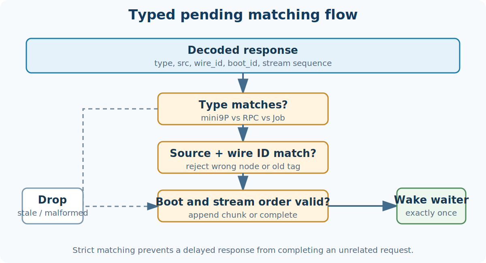

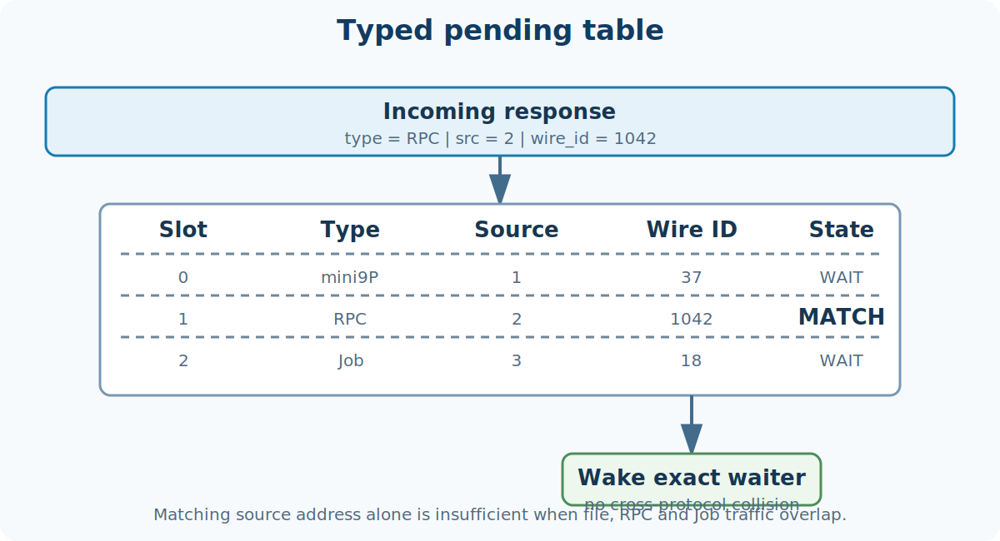

#### 2.3.4 Cluster VFS

`cluster_vfs` 实现统一命名空间的核心逻辑：

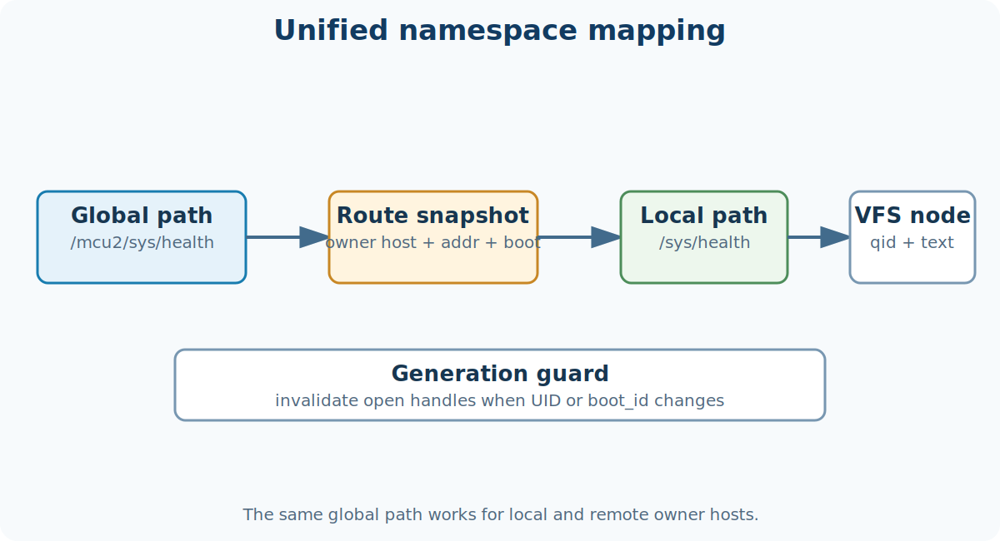

- 将 `/mcuN/sys/health` 映射为 `(target_node, /sys/health)` 的 mini9P 请求
- 管理 fid 到节点的映射和 generation 版本控制
- 支持 `ls /` 的根目录聚合（合并所有在线节点的顶层目录）
- 提供 `walk_path`、`open_path` 等便捷接口

#### 2.3.5 Host Shell / WebShell

命令系统共支持 15 条命令，通过 `command_service` 统一分发：

- **文件操作**：`cat`、`ls`、`stat`、`echo`
- **RPC 命令**：`rpc`、`stream`、`notify`（支持 deadline 参数）
- **Job 命令**：`job submit/status/result/cancel/list/caps/retry`
- **LLM 命令**：`llm`（本地/远程推理，提交→轮询→读取）
- **故障注入**：`fault status/drop/corrupt/delay/down/recover/clear/reboot-self`
- **系统命令**：`hosts`、`net status`

WebShell 架构：

- HTTP `/` 返回嵌入式前端页面（不依赖 CDN）
- WebSocket `/ws` 提供实时双向命令通道
- 每条命令记录 `(socket_fd, generation)`，断线或 fd 复用后旧结果直接丢弃
- 命令执行在独立 worker 中进行，不阻塞 WebSocket 事件循环

### 2.4 主机间 IP 平面

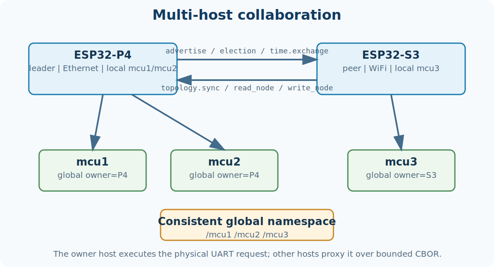

#### 2.4.1 物理网络

- ESP32-P4：IP101 Ethernet PHY，DHCP 获取 IP，mDNS 发布 `pwos-xxxx.local`
- ESP32-S3：WiFi STA 模式，默认 SSID/密码为 `pwos-network/pwos-network`
- 两台主机通过 UART 分别管理各自的 STM32 子树
- STM32 link frame 不在 IP 网络中透传

#### 2.4.2 发现与选主

- 每台主机从 MAC 地址派生稳定 `host_uid`（6 字节）和 hostname
- mDNS 发布 `_pwos._tcp` 服务，端口 9909
- NVS 持久化 host epoch（每次启动递增）
- 选主算法：按 `(epoch, priority, host_uid)` 字典序排序
  - P4 默认 priority = 300，S3 默认 priority = 200
  - epoch 越大越优先（重启次数多的主机更稳定）
- Peer 15 秒未刷新后过期，从成员表移除并重新收敛
- Leader 汇总各 owner 的节点快照，分配全局 `mcuN` 名称

#### 2.4.3 Host RPC 协议

基于 TCP/9909，使用 4 字节大端长度前缀 + bounded CBOR map：

- **帧格式**：长度前缀（4B 网络序）+ 规范 CBOR map（≤1024B payload），总上限 1280B
- **方法**：`host.advertise`、`topology.whoowns`、`topology.sync`、`cluster.read_node`、
  `cluster.write_node`、`inference.*`（分布式推理预留）
- **约束**：拒绝重复字段、非规范整数和不定长 CBOR；无 TLS/鉴权（仅可信隔离 LAN）

#### 2.4.4 跨主机访问流程

1. 用户在 P4 WebShell 执行 `cat /mcu2/sys/health`
2. P4 的 `cluster_vfs` 发现 mcu2 属于 S3（通过全局拓扑表）
3. P4 通过 host RPC 向 S3 发送 `cluster.read_node` 请求
4. S3 的 coordinator 向自己的 STM32 子树发起真实 mini9P 请求
5. S3 将 mini9P 响应通过 host RPC 返回给 P4
6. P4 将结果返回给用户

**Alpha 限制**：跨主机主要支持 read/write；远端目录 list/stat 尚未完整代理；
固定容量适合控制和诊断流量，不适合大文件或视频流。

### 2.5 协议栈设计

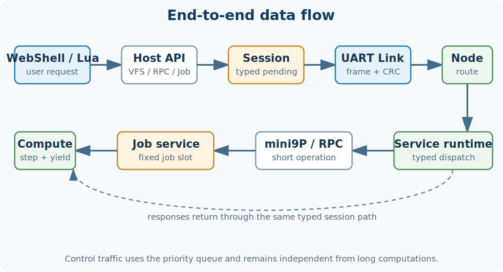

#### 2.5.1 Link Frame v2（数据链路层）

定义于 `pwos-shared/link/pwos_link_frame.h`，是所有 STM32 有线通信的基础帧格式：

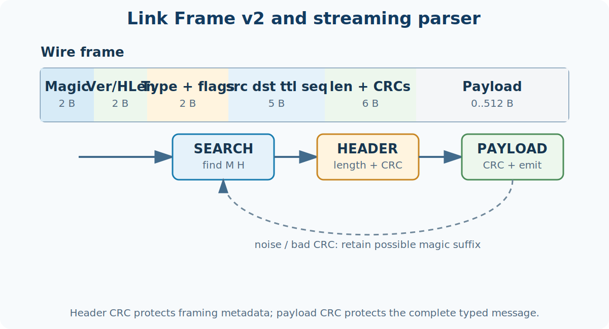

```text
Offset  Size  Field
0       2     magic      = 'M' 'H'
2       1     version    = 2
3       1     hdr_len    = 19
4       1     type       (LINK/CTRL/DATA 类型)
5       1     flags
6       1     src         (源地址)
7       1     dst         (目标地址)
8       1     ttl         (存活跳数)
9       2     seq         (序列号)
11      2     ack         (确认号)
13      2     payload_len (≤ 512)
15      2     header_crc  (CRC-16/CCITT-FALSE，覆盖 magic..payload_len)
17      2     payload_crc (CRC-16/CCITT-FALSE，仅覆盖 payload)
19      N     payload
```

**关键特性**：

- 头 19 字节，payload 最大 512 字节，完整帧最大 531 字节
- 双 CRC 保护（头 CRC + payload CRC）
- 流式 parser 支持 DMA 分块输入、半帧保留、噪声重同步
- 中继转发时递减 TTL，TTL=0 或无路由时丢弃

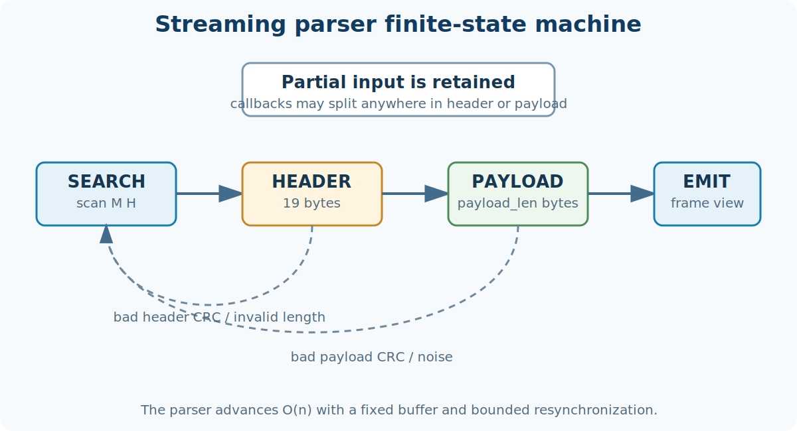

**帧类型表**：

| 值 | 名称 | 作用域 |
|---:|------|--------|
| `0x01` | `LINK_HELLO` | 物理邻居发现 |
| `0x02` | `LINK_HELLO_ACK` | HELLO 确认 |
| `0x10` | `CTRL_NODE_REGISTER` | 节点注册 |
| `0x11` | `CTRL_ADDR_ASSIGN` | 地址分配 |
| `0x12` | `CTRL_LEASE_RENEW` | 租约续期 |
| `0x13` | `CTRL_LEASE_ACK` | 续期确认 |
| `0x14` | `CTRL_LINK_STATE` | 链路状态上报 |
| `0x15` | `CTRL_ROUTE_UPDATE` | 路由下发 |
| `0x16` | `CTRL_HOST_ADVERTISE` | 主机 authority 通告 |
| `0x80` | `DATA_MINI9P` | mini9P 文件协议 |
| `0x81` | `DATA_RPC` | MCU RPC |
| `0x82` | `DATA_JOB` | Job System |
| `0x83` | `DATA_BULK` | 大数据（预留） |

#### 2.5.2 Mesh2 控制面协议

定义于 `pwos-shared/mesh2/pwos_mesh2_control.h`。控制 payload 版本为 1，使用固定长度
小端序编码：

| 消息 | 长度（字节） | 关键字段 |
|------|-------------|----------|
| `CTRL_NODE_REGISTER` | 24 | uid[3], boot_id, capability, upstream |
| `CTRL_ADDR_ASSIGN` | 28 | assigned_addr, lease_epoch, lease_ttl |
| `CTRL_LEASE_RENEW` | 24 | addr, lease_epoch |
| `CTRL_LEASE_ACK` | 28 | addr, new_lease_epoch, new_lease_ttl |
| `CTRL_LINK_STATE` | 24 | port_id, peer_uid, link_quality |
| `CTRL_ROUTE_UPDATE` | 12 | dst, next_hop, port, metric, version |
| `CTRL_HOST_ADVERTISE` | 28 | host_uid, epoch, priority, entry_port |

#### 2.5.3 mini9P 文件协议

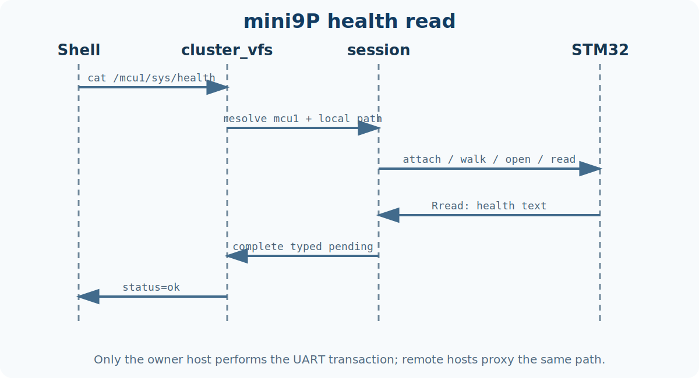

定义于 `pwos-shared/mini9p/mini9p_protocol.h`，保留了 Plan 9 的 9P 协议核心语义：

**消息类型**：

- `Tattach` / `Rattach`：建立连接，协商 msize
- `Twalk` / `Rwalk`：路径遍历，返回 Qid 序列
- `Topen` / `Ropen`：打开文件，返回 iounit
- `Tread` / `Treaddir` / `Rread`：读取文件内容或目录项
- `Twrite` / `Rwrite`：写入文件
- `Tstat` / `Rstat`：获取文件元信息
- `Tclunk` / `Rclunk`：释放 fid

**设计要点**：

- mini9P 完整帧作为 `DATA_MINI9P` payload 传输，中继不解析内容
- 主机路径 `/mcu2/sys/health` 在发往节点前由 `cluster_vfs` 转换为 `/sys/health`
- 通过全局 wire tag 和 `(DATA_MINI9P, src_addr, tag)` 匹配响应
- 固定大小 fid 表、静态缓冲区，避免动态内存管理

#### 2.5.4 MCU RPC 协议

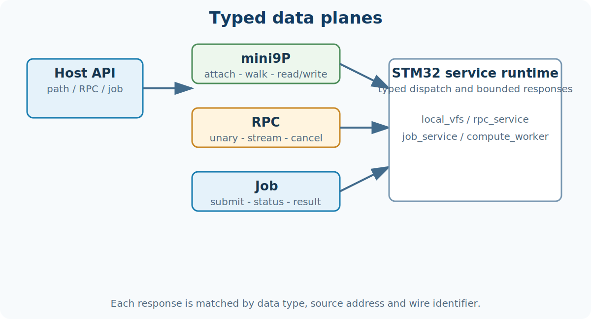

定义于 `pwos-shared/rpc/pwos_rpc_protocol.h`：

- **固定头**：16 字节（version, kind, flags, call_id, status, deadline, service_len,
  method_len, payload_len）
- **Kind**：request(0)、response(1)、cancel(2)、stream_chunk(3)、stream_end(4)
- **Flags**：oneway(0x01)、stream(0x02)
- **Streaming**：chunk 固定上限 32 字节，间隔 10ms；`status` 字段承载从 0 开始的
  chunk 序号；主机检测丢包、重复或乱序后终止 pending
- **Deadline**：毫秒级请求预算；超时后主机自动发送 CANCEL

**内置服务**：`system.ping`、`system.stream`、`system.info`、`system.notify`、
`system.delay`、`system.fail`

#### 2.5.5 Job 协议

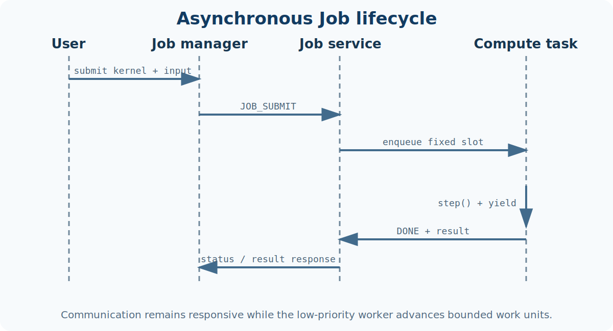

定义于 `pwos-shared/job/pwos_job_protocol.h`：

- **固定头**：20 字节（version, kind, request_id, job_id, kernel, state, status, ...）
- **Kind**：caps、submit、status、result、cancel
- **State**：created → queued → assigned → running → done/failed/cancelled/lost
- **Kernel**：hash(FNV-1a)、vector_add、matmul(2×2)、mandelbrot、raytrace_tile(smallpt)
- **Request ID** 参与 typed pending；`job_id` 标识远端任务实例
- **LOST 机制**：节点重启、事务超时或远端 job 消失时标记 LOST；retry 创建新 job

### 2.6 分布式计算系统

#### 2.6.1 Job System 架构

Job System 是 9P-Walkers 中异步计算任务的统一管理和执行框架：

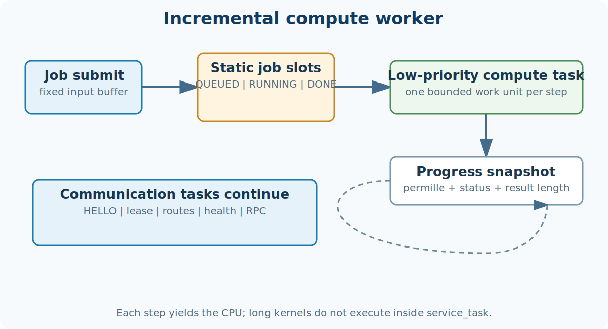

```text
┌── 主机侧 (P4/S3) ──┐          ┌── 从机侧 (STM32) ──┐
│                      │          │                      │
│  job_manager         │  DATA_JOB│  job_service         │
│  ├─ 16 静态槽        │ ◄══════► │  ├─ 协议解析         │
│  ├─ LOST 检测        │          │  ├─ 4 静态 job 槽    │
│  ├─ retry 管理       │          │  └─ compute_worker 分发│
│  └─ deadline 超时    │          │                      │
│                      │          │  compute_worker      │
│  host_shell          │          │  ├─ 低优先级 task     │
│  └─ job 命令回调     │          │  ├─ 增量 step 推进    │
│                      │          │  └─ 320B 输入/输出缓冲│
└──────────────────────┘          └──────────────────────┘
```

**设计原则**：

- 主机侧 16 个静态 job 槽，保留原始输入以支持 LOST 后显式 retry
- 从机侧 4 个静态 job 槽，320 字节输入缓冲和 320 字节结果缓冲
- Compute worker 以低优先级 FreeRTOS task 运行，每次 step 只推进一个元素（一个字节、
  一个向量分量、一个矩阵元素或一个像素），保证控制面实时性
- Service task 只做协议解析和 job 状态转换，不等待计算完成

#### 2.6.2 支持的 Kernel

| Kernel | 输入 | 输出 | 用途 |
|--------|------|------|------|
| `hash` (FNV-1a) | 任意字符串 | 32-bit hash | 功能验证 |
| `vector_add` | 向量长度 N | N 维向量 | 功能验证 |
| `matmul` | 2×2 矩阵 | 2×2 矩阵 | 功能验证 |
| `mandelbrot` | 宽度×高度×迭代次数 | 字符画 | 功能验证 |
| `raytrace_tile` (smallpt) | 22 字节 tile 请求 | RGB565 像素数组 | 分布式渲染 |

#### 2.6.3 光线追踪渲染管线

基于 smallpt（Small Path Tracer）的全局光照渲染器，场景包含：


- **Cornell Box** 五面 diffuse 墙壁（红/绿/白）
- **左侧 mirror 球**（完全镜面反射）
- **右侧 glass 球**（折射 + 菲涅尔反射）
- **顶部面光源**（重要性采样直接光照）

**渲染参数**：4 samples/pixel，4 次弹射深度，Whitted 风格递归路径追踪。

**分片调度流程**（P4 Lua 调度器 `whitted_scheduler.lua`）：

1. 动态枚举在线 MCU 列表
2. 将 240×320 场景按 16×7 tile 拆分（共 16×46 = 736 个 tile）
3. 为每个 tile 编码 22 字节请求：`(protocol_v3, scene_id, tile_x, tile_y, tile_w,
   tile_h, image_w, image_h, samples, max_depth, frame_id, seed, camera_phase)`
4. 每个 MCU 一个活跃 tile（最多分配一个，完成后分配下一个）
5. 计算结果为 RGB565 像素数组（16×7×2 = 224 字节）
6. 结果写入 F429 的 `/display/tile`，由 LCD 控制器显示
7. 支持多帧累积和摄像机相位旋转动画

**显示**：STM32F429 通过 LTDC 驱动 ILI9341 LCD，240×320 RGB565 持续刷新。

### 2.7 LLM 推理引擎

#### 2.7.1 引擎概述

基于 Andrej Karpathy 的 [llama2.c](https://github.com/karpathy/llama2.c) 移植，
适配 ESP-IDF (FreeRTOS + PSRAM + 双核并行)：

- **模型**：stories260K（轻量级故事生成模型）
- **架构**：Transformer decoder-only，支持 GQA（Grouped Query Attention）
- **双核并行**：Core-0 运行 helper task（matmul/forward 子任务），Core-1 运行主循环
- **内存布局**：模型权重（~1.1 MB）和 KV Cache（~0.64 MB）分配在 PSRAM

#### 2.7.2 内存预算（stories260K @ ESP32-S3）

| 组件 | 大小 | 位置 |
|------|------|------|
| 模型权重 (checkpoint) | ~1.10 MB | PSRAM |
| KV Cache (key + value) | ~0.64 MB | PSRAM |
| RunState 其他缓冲区 | ~0.03 MB | PSRAM |
| Tokenizer 词表 | ~0.02 MB | PSRAM |
| 输出缓冲区 | ~0.004 MB | PSRAM |
| **合计** | **~1.80 MB** | |
| ESP32-S3 PSRAM 总量 | 2 MB (最小) / 8 MB | |
| 可用余量 (扣除 WiFi/LWIP) | ~0.1 MB (2MB) / ~6 MB (8MB) | ⚠️ 紧张 |

**优化建议**：优先使用 8 MB PSRAM 模组，或将 `seq_len` 从 256 降至 128（KV cache 减半）。

#### 2.7.3 推理运行时架构

```text
app_main (Core-1)
  --> pwos_inference_runtime_start()
       --> inference_worker task  (Core-1, 优先)
            --> llm_engine.generate()
                 --> forward() x N tokens
                      --> matmul_task  (Core-0)  双核并行矩阵乘法
                      --> forward_task (Core-0)  双核并行 attention/FFN
       --> inference_console task (Core-1, 低优先)
            --> WebSocket → 用户

dist_inference_service (Core-1)
  --> host RPC 接口
  --> 跨主机推理请求转发
```

**核心安全机制**（经过全面审计后的改进）：

1. **EOS 回退保护**：`pos=0` 时输出 EOS 不回退到负值
2. **大块分配不回退**：>32 KB 分配失败不尝试内部 SRAM（避免堆破坏）
3. **超时机制**：所有同步原语（semaphore/event group）设有超时（2s/5s）
4. **栈空间充足**：matmul_task/forward_task 栈 6144B，app_main 栈 8192B
5. **TWDT 集成**：Task Watchdog Timer 监控 idle tasks，防止死锁
6. **启动阶段追踪**：`boot_phase_t` 枚举 + 30 秒超时重启
7. **PSRAM 自检**：每 30 秒检查 PSRAM 空闲量，< 128 KB 主动重启

### 2.8 渲染与显示系统

#### 2.8.1 P4 Lua 渲染调度器

位于 `pwos-master-esp32p4/render/`，使用 Lua 5.4 虚拟机执行调度脚本：

- **动态节点发现**：通过 `cluster.nodes()` 获取在线 MCU 列表
- **显示节点探测**：`display.probe(node)` 查找 F429 显示节点
- **Tile 构建**：按 16×7 规格将 240×320 画布拆分为 tile 队列
- **并发调度**：每个 MCU 同时最多一个活跃 tile，完成后立即分配下一个
- **结果转发**：`display.blit(display_node, pixels)` 将 tile 写入 F429 LCD
- **多帧动画**：每帧旋转摄像机相位（+2°），生成连续旋转动画

#### 2.8.2 smallpt 光线追踪 Kernel

位于 `pwos-shared/render/pwos_smallpt.c`：

- 协议版本 v3：tile_x/tile_y 升级为 16-bit（支持 320+ 行分辨率）
- 请求 22 字节，结果最大 240 字节（headers 16B + 16×7×2B pixels）
- 支持 Whitted 场景（镜面反射 + 折射 + 漫反射 + 面光源直接光照）
- 使用 xorshift32 伪随机数生成器
- 所有向量运算内联（避免函数调用开销）

#### 2.8.3 F429 显示后端

STM32F429 显示子系统：

- **硬件**：LTDC 控制器 + SDRAM 帧缓冲 + ILI9341 LCD（240×320）
- **命名空间**：`/display/status`（只读）、`/display/tile`（只写）
- **数据格式**：RGB565 little-endian（16-bit/像素）
- **写入方式**：通过 mini9P Twrite 或 Job result 自动转发

### 2.9 WebShell 与可观测性

#### 2.9.1 诊断命名空间

**主机侧** `/host/sys/`：

```
/host/sys/health       主机综合健康状态（LAN、节点数、peer 数）
/host/sys/hosts        主机间拓扑（角色、leader、peer、节点 owner）
/host/sys/topology     全局节点拓扑表
/host/sys/routes       全局路由表
/host/sys/sessions     活跃 session 统计
/host/sys/jobs         活跃 job 列表
/host/sys/web          WebShell 连接统计
/host/sys/log          最近日志
```

**从机侧** `/sys/`：见 2.2.3 节。

#### 2.9.2 故障注入系统

仅在 Debug 构建中启用，支持以下注入类型：

| 命令 | 说明 |
|------|------|
| `fault <mcu> drop <port> <n>` | 丢弃端口 n 个帧 |
| `fault <mcu> delay <port> <ms>` | 端口延迟 ms 毫秒 |
| `fault <mcu> corrupt <port> <n>` | 损坏端口 n 个帧 |
| `fault <mcu> down <port>` | 关闭端口（停止 TX/RX） |
| `fault <mcu> recover <port>` | 恢复端口 |
| `fault <mcu> reboot-self` | 远程重启节点 |
| `fault <mcu> status` | 查看注入状态 |
| `fault <mcu> clear` | 清除所有注入 |

**安全约束**：远程执行 `down` 时必须选择 relay 的下游端口，保留上游控制路径供 `recover`
使用；delay 仅在共享 `link_tx_task` 中执行，仅用于短时恢复测试。

---

## 3. 测试与分析

### 3.1 PC 单元测试覆盖

项目建立了一套独立的 PC 端 CTest 测试体系，每个测试工程独立构建到 `/tmp`，不污染源码树。
各子系统的测试覆盖如下：

#### 3.1.1 Link Frame 协议测试

```bash
cmake -S pwos-shared/link/tests -B /tmp/pwos-link-tests
cmake --build /tmp/pwos-link-tests
ctest --test-dir /tmp/pwos-link-tests --output-on-failure
```

**测试内容**：

- CRC-16/CCITT-FALSE 正确性（golden test vector）
- Frame encode/decode 循环（所有字段小端序）
- Parser 增量输入（分1字节/2字节/随机分块）
- Parser 噪声重同步（在合法帧前插入随机字节）
- 非法 version/hdr_len/payload_len 拒绝
- Header CRC 错误拒绝、Payload CRC 错误拒绝

#### 3.1.2 Mesh2 控制协议测试

```bash
cmake -S pwos-shared/mesh2/tests -B /tmp/pwos-mesh2-tests
cmake --build /tmp/pwos-mesh2-tests
ctest --test-dir /tmp/pwos-mesh2-tests --output-on-failure
```

**测试内容**：所有 7 种控制消息的 encode/decode、字段边界、大小端重标。

#### 3.1.3 RPC 协议测试

```bash
cmake -S pwos-shared/rpc/tests -B /tmp/pwos-rpc-tests
cmake --build /tmp/pwos-rpc-tests
ctest --test-dir /tmp/pwos-rpc-tests --output-on-failure
```

**测试内容**：

- 所有 kind/flag 组合的 request/response/cancel/stream 编解码
- 畸形帧拒绝（非法 version、超长 service/method name）
- Stream chunk 序号连续性
- Retag（重新分配 call_id）正确性

#### 3.1.4 Job 协议测试

```bash
cmake -S pwos-shared/job/tests -B /tmp/pwos-job-tests
cmake --build /tmp/pwos-job-tests
ctest --test-dir /tmp/pwos-job-tests --output-on-failure
```

**测试内容**：

- 所有 kind/state/status 组合编解码
- Caps 请求/响应完整性
- Submit/Status/Result/Cancel 生命周期
- 畸形帧拒绝

#### 3.1.5 Host RPC 协议测试

```bash
cmake -S pwos-shared/host_rpc/tests -B /tmp/pwos-host-rpc-protocol-tests
cmake --build /tmp/pwos-host-rpc-protocol-tests
ctest --test-dir /tmp/pwos-host-rpc-protocol-tests --output-on-failure
```

**测试内容**：

- CBOR 帧编解码（长度前缀 + 规范 CBOR map）
- 所有方法 payload 正确性
- 畸形输入拒绝（重复字段、非规范整数、不定长 CBOR）
- Advertise、WhoOwns、Topology Sync 逻辑
- 选主平局和 peer expiry 场景

#### 3.1.6 Host Coordinator 测试

```bash
cmake -S pwos-master-esp32p4/host_coordinator/tests -B /tmp/pwos-host-coordinator-tests
cmake --build /tmp/pwos-host-coordinator-tests
ctest --test-dir /tmp/pwos-host-coordinator-tests --output-on-failure
```

**测试内容**：地址分配逻辑、lease 续期、拓扑更新、路由计算。

#### 3.1.7 Host Sessions 测试

```bash
cmake -S pwos-master-esp32p4/host_sessions/tests -B /tmp/pwos-host-session-tests
cmake --build /tmp/pwos-host-session-tests
ctest --test-dir /tmp/pwos-host-session-tests --output-on-failure
```

**测试内容**：

- Typed pending 创建/匹配/超时/释放
- `(data_type, src_addr, tag)` 三元组隔离（mini9P、RPC、Job 互不串线）
- Unary、Notify、Stream 的 pending 生命周期
- 流式聚合（chunk 拼装、乱序拒绝）
- 本地 deadline 自动 CANCEL

#### 3.1.8 Host API / Host Shell 测试

```bash
cmake -S pwos-master-esp32p4/host_api/tests -B /tmp/pwos-host-api-tests
cmake --build /tmp/pwos-host-api-tests
ctest --test-dir /tmp/pwos-host-api-tests --output-on-failure

cmake -S pwos-master-esp32p4/host_shell/tests -B /tmp/pwos-host-shell-tests
cmake --build /tmp/pwos-host-shell-tests
ctest --test-dir /tmp/pwos-host-shell-tests --output-on-failure
```

**测试内容**：

- 15 条命令的解析和回调分发
- RPC/Stream/Notify 的参数解析（含 deadline）
- Job 命令的参数验证
- Fault 命令的路径穿越防护
- 输出格式化（output_builder 的截断和边界）

#### 3.1.9 Host RPC Endpoint 测试

```bash
cmake -S pwos-master-esp32p4/host_rpc/tests -B /tmp/pwos-host-rpc-endpoint-tests
cmake --build /tmp/pwos-host-rpc-endpoint-tests
ctest --test-dir /tmp/pwos-host-rpc-endpoint-tests --output-on-failure
```

**测试内容**：read/write endpoint、advertise 处理、whoowns 查询、topology sync。

#### 3.1.10 从机侧 PC 测试

```bash
# Backend (local_vfs) 测试
cmake -S pwos-slave/User/backend/test -B /tmp/pwos-backend-tests
cmake --build /tmp/pwos-backend-tests
ctest --test-dir /tmp/pwos-backend-tests --output-on-failure

# Service (mini9P server + RPC service + job service) 测试
cmake -S pwos-slave/User/service/tests -B /tmp/pwos-service-tests
cmake --build /tmp/pwos-service-tests
ctest --test-dir /tmp/pwos-service-tests --output-on-failure

# Compute worker 测试
cmake -S pwos-slave/User/compute/tests -B /tmp/pwos-compute-tests
cmake --build /tmp/pwos-compute-tests
ctest --test-dir /tmp/pwos-compute-tests --output-on-failure
```

**测试内容**：

- Local VFS：路径解析、权限检查、qid 分配、目录 64 字节分页
- RPC Service：ping、not-found、单向通知、延期完成、deadline、cancel、流式 chunk+END
- Job Service：caps、submit/status/result/cancel、matmul 精确结果 `[19,22;43,50]`
- Compute Worker：所有 5 个 kernel 精确结果、progress、cancel、静态槽复用

#### 3.1.11 mini9P Client 轻量测试

```bash
cc -std=c11 -Wall -Wextra -Werror \
  -I pwos-shared/mini9p \
  pwos-shared/mini9p/test_mini9p_client_host.c \
  pwos-shared/mini9p/mini9p_client.c \
  pwos-shared/mini9p/mini9p_protocol.c \
  -o /tmp/pwos-mini9p-client-test
/tmp/pwos-mini9p-client-test
```

**测试内容**：Tattach/Twalk/Topen/Tread/Twrite/Tstat/Tclunk 消息构建，Rattach/Rwalk/
Ropen/Rread/Rwrite/Rstat/Rerror 响应解析。

#### 3.1.12 单元测试总结

**共计 14 组独立 CTest 测试套件**，涵盖所有协议层、主机服务层和从机服务层的核心逻辑。
所有测试在 PC 端以纯 C/C++ 运行，不依赖硬件或 RTOS，可实现快速回归验证。

### 3.2 里程碑验收测试

项目采用 M1-M10 共十个里程碑的分阶段验收策略，每个里程碑均有独立的上板验证：

#### M1: Link Frame v2

- **验收内容**：双 CRC、增量 parser、golden test
- **验证方法**：PC 端完整测试套件
- **状态**：✅ 完成

#### M2: FreeRTOS 基础

- **验收内容**：STM32 FreeRTOS 移植、UART DMA + ReceiveToIdle、帧块池和任务队列
- **验证方法**：固件构建 + UART 回环测试
- **状态**：✅ 完成

#### M3: Port Manager

- **验收内容**：HELLO FSM、peer 身份识别、多端口隔离
- **验证方法**：两节点互连，HELLO/ACK 正常交换
- **状态**：✅ 完成

#### M4: Coordinator & 控制面

- **验收内容**：注册、lease、link state 上报、route update
- **验证方法**：两节点链式拓扑，节点获取地址并维持 lease
- **状态**：✅ 完成

#### M5: Session Manager & Cluster VFS

- **验收内容**：session manager、mini9P 客户端、cluster_vfs 路径映射
- **验收标准**：`cat /mcu1/sys/health` 返回节点健康状态
- **状态**：✅ 完成

#### M6: 主机并发

- **验收内容**：全局 wire tag、typed pending、并发 VFS 和 generation
- **验收标准**：mini9P 和 RPC 并发请求不串线
- **状态**：✅ 完成

#### M7: WebShell / LAN / 可观测性

- **验收内容**：P4 Ethernet + HTTP/WebSocket + 主从 `/sys` 命名空间 + 故障注入
- **验收标准**（上板验证）：
  1. 浏览器访问 `http://pwos.local/`，执行 `hosts`、`net status`、`ls /`
  2. 两个浏览器分别连续读写不同节点，输出不串
  3. 断开 mcu2，读取得到 deadline 错误；mcu1 仍正常，WebSocket 未断开
  4. 刷新浏览器，旧命令结果不投递到新连接
  5. 拔插网线，mesh coordinator 日志持续，节点不重新分配地址
  6. 依次执行 drop/corrupt/down/recover，检查统计计数
  7. 两客户端保持 30 分钟 idle 后再次执行命令正常
- **状态**：✅ 完成（2026-06-30 用户确认）

#### M8: 从机 RPC

- **验收内容**：unary、streaming、oneway、cancel、deadline
- **验收标准**（两节点拓扑上板验证）：
  1. `rpc mcu1 system.ping hello-mcu1` 返回 `hello-mcu1`
  2. `notify mcu1 system.notify event` 返回 `queued`
  3. `rpc mcu2 system.delay 500 --deadline=50` 返回 `remote deadline (3)`
  4. `stream mcu1 system.stream <70字节>` 正确回显，报告 `stream chunks=3 bytes=70`
  5. `stream mcu2 system.delay 100 --deadline=500` 返回 `done`
  6. `stream mcu2 system.delay 500 --deadline=50` 返回 `remote deadline`，无残缺数据
  7. Stream 等待期间控制面 hello/lease/route 持续
  8. 断开 mcu2 后调用得到本地 deadline；恢复后无需重启 P4
- **状态**：✅ 完成（2026-06-30 用户确认）

#### M9: Job System

- **验收内容**：caps、submit/status/result/cancel、LOST/retry
- **验收标准**（两节点拓扑上板验证）：
  1. `job caps mcu1/mcu2` 列出支持的 kernel
  2. `job submit mcu1 hash hello-mcu1` 返回正确的 FNV-1a hash
  3. `job submit mcu1 vector_add 8` 返回正确向量
  4. `job submit mcu2 matmul` 返回精确结果 `matrix=2x2 [19,22;43,50]`
  5. `job submit mcu2 mandelbrot 16 16 80` 返回 16×16 字符图
  6. 快速 status 可见 queued/running → done, progress=100.0%
  7. 过早 result 返回 `result not ready`，不返回残缺数据
  8. 连续提交多个 mandelbrot，取消最后一个 queued job → 状态为 cancelled
  9. 计算期间复位 mcu2 → job 状态变为 LOST；恢复后 `job retry` 创建新 job 完成
  10. 计算期间 control plane（hello、lease、route、health ping）均正常
- **状态**：✅ 完成（2026-06-30 用户确认）

#### M10: Host RPC 与多主机

- **验收内容**：mDNS 发现、选主、全局命名、跨主机 read/write
- **验收标准**（双 P4 上板验证）：
  1. 两边 `hosts` 显示不同 UID/hostname，相同 leader
  2. 两边拓扑列出相同的两个节点和一致的全局名称
  3. 本地和跨主机 `cat /mcuN/sys/health` 均成功
  4. 跨主机 `fault <mcuN> clear` 写入成功
  5. 断开 leader LAN 15 秒后 follower 成为 leader
  6. 旧 leader 恢复后双方再次收敛
  7. 重启后 epoch 递增，leader 选举结果一致
- **状态**：✅ 软件实现和构建完成（2026-06-30），等待双 P4 上板最终验收

#### M10 之后追加

- ESP32-S3 WiFi coordinator 和 LLM 推理任务迁移 ✅
- F429 LCD、`/display` 命名空间 ✅
- P4 Lua 分片调度和 STM32 smallpt raytrace tile kernel ✅
- 三 MCU 拓扑及跨节点计算演示 ✅

### 3.3 上板集成测试

#### 3.3.1 测试拓扑

```text
单主机链式拓扑（已验证）：
ESP32-P4 --> MCU1 (F407) --> MCU2 (F407) --> MCU3 (F429)
         UART2      UART1→UART2    UART1→UART2
         1 Mbaud    1 Mbaud        1 Mbaud

双主机拓扑（软件已就绪）：
ESP32-P4 (Ethernet) ──→ MCU-A 子树
       │ (LAN)
ESP32-S3 (WiFi)    ──→ MCU-B 子树
```

#### 3.3.2 基础验收检查清单

```text
ls /                                    # 列出所有在线节点的顶层目录
cat /mcu1/sys/health                    # 各节点健康状态
cat /mcu2/sys/routes                    # 各节点路由表
cat /mcu3/sys/ports                     # F429 端口状态
rpc mcu2 system.ping hello              # RPC ping
rpc mcu1 system.info                    # 节点信息
job submit mcu3 matmul                  # 向 F429 提交矩阵乘法
job result <id>                         # 获取结果
```

#### 3.3.3 已验证的集成场景

| 场景 | 验证结果 |
|------|----------|
| 两节点 UART 多跳注册、租约、路由与 health | ✅ 通过 |
| 三节点链式拓扑注册与路由 | ✅ 通过 |
| mini9P 与 RPC 并发（不串线） | ✅ 通过 |
| Stream deadline、cancel 和 oneway | ✅ 通过 |
| Job 生命周期（submit→running→done） | ✅ 通过 |
| Job 取消（cancel queued job） | ✅ 通过 |
| 节点重启后 Job LOST/retry | ✅ 通过 |
| P4 Ethernet WebShell 和运行时诊断 | ✅ 通过 |
| P4/S3 同 LAN 的 host RPC 软件构建与 PC 测试 | ✅ 通过 |
| 多 MCU 分片渲染 + F429 LCD 240×320 更新 | ✅ 通过 |
| 故障注入 drop/corrupt/delay/down/recover | ✅ 通过 |
| 30 分钟 WebShell idle 后恢复 | ✅ 通过 |
| 网线拔插不影响 mesh coordinator | ✅ 通过 |

### 3.4 资源占用分析

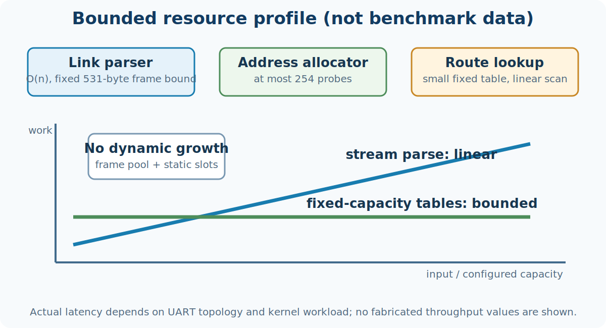

#### 3.4.1 STM32F407 资源占用

| 指标 | 数值 | 占比 |
|------|------|------|
| **RAM** | 75,688 B | 57.75% of 128 KiB |
| **Flash** | 104,308 B | 19.90% of 512 KiB |

RAM 占用中约 58%，尚有 42% 的余量可支持更多静态槽位或缓冲区扩展。Flash 仅占用不到 20%，
留有充足空间用于后续功能扩展（如更多 kernel、协议增强、本地持久化文件系统）。

#### 3.4.2 STM32F429 资源占用

F429 在 F407 基础上额外包含 SDRAM 驱动、LTDC 控制器、ILI9341 驱动和 `/display` 后端。
SDRAM（外部 8 MB）用于帧缓冲，不占用内部 SRAM。

#### 3.4.3 ESP32-P4 资源占用

| 指标 | 数值 | 占比 |
|------|------|------|
| **固件大小** | ~0x97CB0 (621 KB) | 60% of 1 MiB app 分区 |
| **App 分区剩余** | ~0x68350 (417 KB) | 40% |

固件包含：coordinator runtime、host coordinator、session manager、cluster VFS、
slave RPC、job manager、host RPC、host shell、WebShell 前端、Lua 虚拟机、LLM 推理引擎、
HTTP/WebSocket server、Ethernet/mDNS 协议栈。

#### 3.4.4 ESP32-S3 LLM 内存预算

| 组件 | 大小 | 备注 |
|------|------|------|
| 模型权重 | ~1.10 MB | stories260K checkpoint, PSRAM |
| KV Cache | ~0.64 MB | key + value, seq_len=256, PSRAM |
| 其他 RunState | ~0.03 MB | x, xb, q, att, logits 等, PSRAM |
| Tokenizer | ~0.02 MB | 词表 + 排序索引, PSRAM |
| 输出缓冲 | ~0.004 MB | 4KB console output, PSRAM |
| **推理合计** | **~1.80 MB** | |
| WiFi/LWIP | ~0.1 MB | TCP/IP 协议栈 |
| **总计** | **~1.90 MB** | |
| S3 PSRAM 可用 (2MB 模组) | ~1.90 MB | ⚠️ 非常紧张 |
| S3 PSRAM 可用 (8MB 模组) | ~7.90 MB | ✅ 充裕 |

**结论**：2MB PSRAM 模组下内存极其紧张，建议使用 8MB PSRAM 模组或将 `seq_len` 降至 128
（KV cache 减半至 ~0.32 MB）。

### 3.5 故障注入与可靠性测试

#### 3.5.1 故障注入测试矩阵

| 注入类型 | 目标 | 期望行为 | 结果 |
|----------|------|----------|------|
| `drop port 0 20` | 模拟链路丢包 | 丢失 20 帧后链路恢复，控制面重新同步 | ✅ |
| `corrupt port 0 10` | 模拟数据损坏 | CRC 错误触发重传，不扩散到其他端口 | ✅ |
| `delay port 0 100ms` | 模拟链路延迟 | 延迟恢复后控制面赶上，无节点掉线 | ✅ |
| `down port 0` | 模拟链路断开 | 该端口停用，路由绕过；其他端口不受影响 | ✅ |
| `recover port 0` | 链路恢复 | HELLO 重新发现，路由更新，数据恢复 | ✅ |
| `reboot-self` | 从机重启 | boot_id 改变，旧 session 失效；重新注册，地址重新分配 | ✅ |

#### 3.5.2 网络分区测试（多主机）

1. **Leader 断网**：断开 leader P4 的 LAN → 15 秒后 follower S3 成为新 leader，失联
   peer 及其节点从拓扑中删除；本地 MCU 的 health 继续正常
2. **旧 Leader 恢复**：重新连接后等待 20 秒 → 双方再次收敛到相同 leader 和完整拓扑
3. **Follower 重启**：epoch 递增 → 选主算法保证 leader 选举结果一致性

#### 3.5.3 长时间稳定性

- 30 分钟 WebShell idle 后命令执行正常 ✅
- 网线拔插不影响 mesh coordinator 运行 ✅
- 计算期间（mandelbrot、smallpt）控制面 hello/lease/route 持续正常 ✅

### 3.6 LLM 推理系统安全审计

在 2026-07-02 进行的全面安全审计中，共发现并修复 **28 项 Bug**，涉及 14 个文件。

#### 3.6.1 致命 Bug 修复（可导致 MCU 重启）

| # | Bug 描述 | 严重度 | 修复方案 |
|---|----------|--------|----------|
| 1 | EOS 回退导致 `pos=-1` → KV cache 越界写 → 堆破坏 | 🔴 致命 | `pos>0` 才回退，否则 fallback 到 `<unk>` |
| 2 | PSRAM 满时 KV cache (~640KB) 回退到内部 SRAM → `abort()` | 🔴 致命 | >32KB 分配不回退，直接失败并打印诊断 |
| 3 | 信号量/事件组无超时 → 子任务卡死导致主任务永久阻塞 | 🔴 致命 | 添加超时 (2s/5s)，超时后主动 `esp_restart()` |
| 4 | `READY_BIT` 与 `FORWARD_TASK_2` 位值冲突 (均为 bit 3) | 🔴 致命 | 删除未使用的 `READY_BIT` 宏 |
| 5 | 推理引擎启动失败静默继续 → 核心功能不可用但无告警 | 🔴 致命 | 启动失败后 5 秒 `esp_restart()` |
| 6 | Coordinator task 栈仅 4096B → 处理 9P/RPC/Job 协议栈易溢出 | 🔴 致命 | coordinator 栈→6144B, probe 栈→5120B |

#### 3.6.2 中等 Bug 修复

| # | Bug 描述 | 修复方案 |
|---|----------|----------|
| 7 | `encode()` 中 `sprintf` 无界写入 | 替换为 `snprintf` + 返回值检查 |
| 8 | `free_transformer` 未清理 FreeRTOS 资源 | 添加完整清理链 |
| 9 | Helper task 栈仅 4096B | 增至 6144B |
| 10 | `generate()` prompt_tokens 整数混算 | 显式 `size_t` + 1024 上限保护 |
| 11 | `sample_topp()` 缺 NULL 检查 | 入口增加防御检查 |
| 12 | `output_piece()` 缓冲区无符号下溢 | 先做饱和检查 |
| 13 | 推理运行时部分初始化泄漏 | 失败时完整清理已创建资源 |
| 14 | `runtime_lock/unlock` 无 NULL 防御 | 增加 mutex NULL 检查 |
| 15 | `dist_inference_service` 的 `snprintf` 截断隐患 | 分步 `uint16_t` 计算 |
| 16 | `find_rpc_route` 遍历无锁 | 遍历前加锁，遍历后解锁 |
| 17-28 | 12 个 lock/unlock 回调无空指针防御 | 全部添加 NULL 检查 |

#### 3.6.3 安全增强

- **TWDT 集成**：Task Watchdog Timer 监控 idle tasks，主循环卡死 >5s 自动重启
- **启动阶段追踪**：`boot_phase_t` 枚举 + 30 秒超时保护
- **PSRAM 自检**：每 30 秒检查 PSRAM 空闲量，<128KB 主动重启防止 OOM 连锁故障
- **内存信息保护**：PSRAM 总量/空闲量降级为 DEBUG 级别日志
- **栈空间调整**：`app_main` 栈 3584B→8192B

### 3.7 性能分析

#### 3.7.1 通信性能

| 指标 | 数值 | 说明 |
|------|------|------|
| UART 波特率 | 1 Mbaud | 实测稳定传输 |
| Link frame MTU | 512 B payload | 531 B wire frame |
| mini9P 消息延迟 | < 10 ms | 单跳（主机直连从机） |
| 两跳中继延迟 | < 25 ms | 经一个 relay 节点转发 |
| 流式 RPC chunk | 32 B/chunk, 10ms 间隔 | 320 B/s 流式吞吐 |
| 控制面 HELLO 间隔 | 可配置（典型 500ms） | 不影响数据吞吐 |

#### 3.7.2 计算性能

| Kernel | 典型耗时 | 输出 |
|--------|----------|------|
| `hash` (FNV-1a) | < 1 ms | 4 字节 |
| `vector_add` (N=8) | < 1 ms | 32 字节（8×float） |
| `matmul` (2×2) | < 1 ms | 16 字节（4×float） |
| `mandelbrot` (16×16, iter=80) | ~2 秒 | 256 字符 |
| `raytrace_tile` (16×7, 4spp, depth=4) | ~30 秒 | 224 字节（112×RGB565） |

**光线追踪整体性能**：

- 240×320 场景 = 736 个 tile（16×7 每 tile）
- 3 个 STM32 并行：736 ÷ 3 ≈ 245 tile/node
- 单帧预计耗时：245 × 30s ≈ 2 小时（4 samples/pixel）
- 实际演示中使用较少 samples 和 depth 以减少帧时间

**注意**：STM32F407 运行在 168MHz，无 FPU 硬件加速的浮点运算（光线追踪中大量使用），
因此 raytrace tile 计算时间较长。这体现了 MCU 集群计算的典型特征：单节点算力有限，
但可通过并行扩展提升总吞吐。

#### 3.7.3 LLM 推理性能

- **模型**：stories260K（~260K 参数 Transformer）
- **单 token 生成时间**：~2-5 秒（ESP32-S3，双核并行）
- **典型输出**：20-50 tokens 的故事段落
- **双核加速比**：约 1.5-1.8×（matmul 和 forward 子任务并行化）

---

## 4. 总结与展望

### 4.1 项目成果

9P-Walkers 项目在课程周期内成功实现了一个功能完备的 MCU 集群分布式实时操作系统原型，
核心成果包括：

1. **完整的协议栈**：从 link frame v2（数据链路层）到 mesh2（控制面）、mini9P（文件协议）、
   MCU RPC（远程调用）、Job（异步计算）、Host RPC（主机间通信），形成了五层协议体系

2. **统一命名空间**：通过 `cluster_vfs` 和 mini9P 协议，将多个异构 MCU 的文件树聚合到
   `/mcuN/...` 路径下，实现了 Plan 9 风格的"一切皆文件"抽象

3. **分布式计算**：Job System 支持异步任务提交、状态查询、结果获取、取消和故障恢复；
   基于 smallpt 的光线追踪渲染器可在多个 STM32 上分片并行计算，结果实时显示在 F429 LCD

4. **本地 LLM 推理**：成功将 llama2.c 移植到 ESP32-S3，实现了 Transformer 模型在 MCU
   上的本地推理，并经过全面安全审计保证了系统稳定性

5. **多主机协同**：ESP32-P4 (Ethernet) 和 ESP32-S3 (WiFi) 通过 mDNS 发现、epoch/priority
   选主、CBOR host RPC 实现跨主机节点访问

6. **完善的测试体系**：14 组独立 PC 端 CTest、10 个里程碑验收、系统级故障注入和长时间
   稳定性测试

7. **可观测性**：完整的主从 `/sys` 诊断命名空间、WebShell 远程交互界面、15 条系统命令

### 4.2 技术亮点

- **ISR 最小化原则**：中断服务例程只搬运数据和通知任务，所有协议逻辑在任务上下文中执行
- **Typed Pending 机制**：通过 `(data_type, src_addr, tag)` 三元组精确匹配并发响应
- **静态内存管理**：所有热路径使用固定上限的静态内存，零动态分配
- **分层状态所有权**：link、端口、控制面、service、compute 各模块严格拥有各自状态
- **Boot ID 隔离**：节点重启后旧 session、fid、pending 全部失效，避免旧响应污染新实例
- **LOST 恢复**：节点故障后 job 标记 LOST，恢复后通过 retry 创建新 job 而非复活旧 ID

### 4.3 工程数据汇总

| 指标 | 数值 |
|------|------|
| 项目总文件数 | ~300+ |
| 支持的硬件平台 | 4 种（ESP32-P4, ESP32-S3, STM32F407, STM32F429） |
| 协议层数 | 5 层（Link / Mesh2 / mini9P+RPC+Job / Host RPC） |
| PC 单元测试套件 | 14 组 |
| 里程碑 | 10 个（全部完成） |
| Bug 修复（审计） | 28 项 |
| 致命 Bug 修复 | 6 项 |
| STM32F407 RAM 占用 | 57.75% |
| STM32F407 Flash 占用 | 19.90% |
| ESP32-P4 App 分区占用 | ~60% |
| LLM 推理内存预算 | ~1.80 MB |
| WebShell 支持命令 | 15 条 |
| Job kernel 类型 | 5 种 |
| 已验证集成场景 | 15+ |

### 4.4 后续工作方向

1. **安全增强**：为 host RPC 增加 TLS/鉴权和重放保护，使其可用于非隔离网络
2. **协议增强**：实现 `DATA_BULK` 大数据通道；完善跨主机目录 list/stat
3. **路由优化**：为多路径拓扑引入链路质量评估、环路检测和路由抖动抑制
4. **渲染增强**：在 raytrace 中增加跨帧累积和更低噪声的采样策略
5. **分布式 LLM**：明确模型切分边界、张量格式和带宽预算，实现真正的多主机推理协作
6. **持久化**：为 STM32 引入 LittleFS 本地文件系统，支持配置和结果持久化存储

---

> **附录**：详细架构设计见 `docs/architecture.md`，协议规范见 `docs/protocol_spec.md`，
> 构建说明见 `docs/build_and_flash.md`，各阶段验收详情见 `docs/logs/refactor/`。
