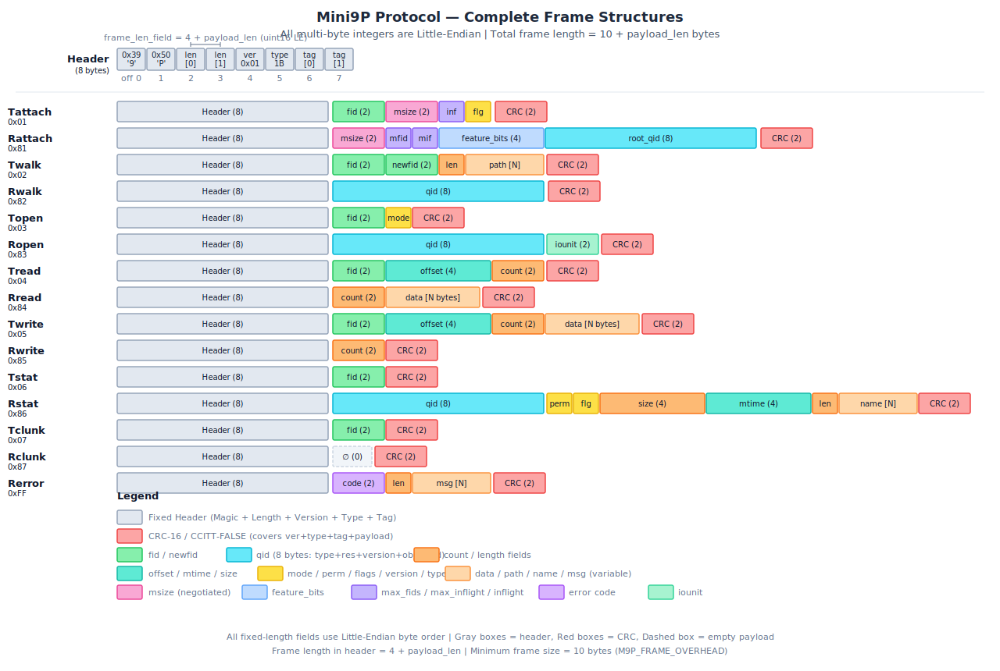

# PWOS ESP32-P4 主控

`pwos-master-esp32p4` 是集群的主控固件目录,基于 ESP-IDF 框架。

## 工程目录结构

```
pwos-master-esp32p4/
├── CMakeLists.txt          # 根 CMake,检查 IDF_PATH
├── main/                   # ESP-IDF 组件入口
│   ├── CMakeLists.txt
│   ├── hello_world_main.c  # app_main 入口
│   ├── lua_bindings.c/.h
│   ├── lua_port.c/.h
│   └── lua_vfs_bindings.c/.h
├── cluster/                # cluster_config:把 mesh 事件翻译给 VFS
│   ├── cluster_config.c
│   └── cluster_config.h
├── mesh/                   # 主机侧 mesh 装配层
│   ├── mesh_host_runtime.c/.h
│   └── mesh_host_service.c/.h
├── vfs_bridge/             # 集群命名空间桥接
│   ├── cluster_host_vfs.c/.h
│   ├── design.md
│   ├── mini9p.md
│   ├── vfs接口说明.md
│   └── test/               # 独立 host test 工程
├── shell/                  # 本地 C shell
│   ├── shell.c
│   └── shell.h
├── web/                    # HTTP + WebSocket + Wi-Fi softAP
│   ├── http_server.c/.h
│   ├── websocket_shell.c/.h
│   ├── wifi_softap.c/.h
│   └── index.html          # 嵌入式 web shell
├── lua/                    # Lua 5.x 源码(裁剪后)
│   └── (lapi.c, lauxlib.c, ...)
└── pytest_hello_world.py   # ESP-IDF pytest 入口
```

## 构建

需要先 source ESP-IDF 环境,保证 `IDF_PATH` 可用。根 `CMakeLists.txt` 在未设置 `IDF_PATH` 时会直接 `FATAL_ERROR` 报错。

```bash
cd pwos-master-esp32p4
idf.py build
idf.py flash
idf.py monitor
# 一条命令完成
idf.py build flash monitor
```

### 组件入口

`main/CMakeLists.txt` 通过 `idf_component_register` 注册组件,关键点:

- 收集 `lua/*.c` 时移除 `lua.c`、`luac.c`、`linit.c`、`liolib.c`、`loslib.c`、`loadlib.c`、`ldblib.c` 等 OS 相关标准库
- 显式把 `pwos-shared/mini9p` 和 `pwos-shared/mesh/{envelope,processer,cluster,transport}` 拉入组件
- `EMBED_FILES "../web/index.html"` 把 web shell 静态资源编进固件
- `PRIV_REQUIRES` 列 `esp_timer`、`spi_flash`、`esp_http_server`、`esp_wifi`、`esp_event`、`esp_netif`、`nvs_flash` 等

## 主机侧 mesh 装配

`mesh/` 子目录提供:

- `mesh_host_runtime`:主机 mesh runtime 对象,封装 `mesh_processer`,处理 `REGISTER`/`LINK_STATE`/`ROUTE_UPDATE`,为已发现节点绑定 mesh-backed mini9P client,挂到 `cluster_config` / `cluster_host_vfs`
- `mesh_host_service`:拥有最多 `MESH_HOST_SERVICE_MAX_PORTS = 4` 个 UART 端口,默认单端口模式使用 `MESH_HOST_SERVICE_NEIGHBOR_ANY == 0xff`

`next_hop -> UART 端口` 由 service 在静态 `neighbor_addr` 配置中查表。详细设计见 `mesh/README.md`。

## Cluster VFS 桥接

`vfs_bridge/cluster_host_vfs.c` 是主控的 VFS 桥接层,提供 `init / discover_node / attach / detach / open / read / write / close / read_path / write_path / list / stat`。设计文档 `vfs_bridge/design.md`、接口详解 `vfs_bridge/vfs接口说明.md`、mini9P 帧格式 `vfs_bridge/mini9p.md`。

## 本地 Shell、Lua、WebShell

- `shell/shell.c` 解析 C shell 命令并把文件访问下推到 `cluster_vfs_*`
- `lua/` 是裁剪后的 Lua 5.x 源码,`main/lua_port.c` + `main/lua_bindings.c` 把 Lua 嵌入主控,`main/lua_vfs_bindings.c` 把 Lua 的 `read/write/list/stat` 落到 `cluster_vfs_*`
- `web/http_server.c` + `web/websocket_shell.c` 提供浏览器 WebShell,`web/wifi_softap.c` 配置 Wi-Fi softAP,`web/index.html` 由 ESP-IDF 嵌入

## Host test

`vfs_bridge/test/` 是独立 CMake 工程,使用帧级 `mock_transport()` 模拟 mini9P server,验证 `cluster_vfs -> mini9p_client -> transport` 真实调用链。`vfs_bridge/test/test说明.md` 描述每个用例。覆盖:重复路由、`/mcu1` vs `/mcu10` 边界、`open/read/write/close`、`stat` 成功/失败路径 clunk、`close` 返回远端错误、远端目录 list、detach 时的 busy 检查等。

```bash
cmake -S pwos-master-esp32p4/vfs_bridge/test -B pwos-master-esp32p4/vfs_bridge/test/build
cmake --build pwos-master-esp32p4/vfs_bridge/test/build
pwos-master-esp32p4/vfs_bridge/test/build/cluster_vfs_test
pwos-master-esp32p4/vfs_bridge/test/build/mesh_host_service_test
pwos-master-esp32p4/vfs_bridge/test/build/mesh_host_runtime_test
```

## ESP-IDF pytest

```bash
cd pwos-master-esp32p4
pytest pytest_hello_world.py
```

## 当前边界

- `mesh_host_runtime` 仍具有全局单事务语义(通过 `dispatch_busy`)
- 主机侧尚未为"远端主动发到主机的 mini9P T*"挂接本地 server handler
- `vfs_bridge/design.md` 和 `vfs_bridge/TODO.md` 中标注 `<!-- 过期说明 -->` 的内容已过期,实际行为以 `cluster_host_vfs.c` 当前实现为准

---

# mini9P 协议帧格式



## 通用帧头（所有帧共享）

任何帧的前 8 字节（偏移 0–7）都是固定头部，后面接 **Payload**，最后 2 字节是 **CRC**：

| 偏移 | 长度 | 字段 | 说明 |
|:----:|:----:|------|------|
| 0 | 1 | `Magic[0]` | 固定 `0x39`，即 ASCII `'9'` |
| 1 | 1 | `Magic[1]` | 固定 `0x50`，即 ASCII `'P'` |
| 2–3 | 2 | `frame_len_field` | 小端 uint16，值 = `4 + payload_len` |
| 4 | 1 | `version` | 协议版本，固定 `0x01` |
| 5 | 1 | `type` | 消息类型（如 `0x04` = Tread） |
| 6–7 | 2 | `tag` | 小端 uint16，事务标签 |
| 8 … 8+N–1 | N | `payload` | 业务数据（每种消息不同） |
| 8+N … 8+N+1 | 2 | `CRC-16` | 小端 uint16，覆盖范围：**version 到 payload 末尾** |

> 总长度恒为 `10 + payload_len` 字节。

---

## 会话与 fid 约定

- 当前仓库中的 `mini9p_client` 实现固定使用 `fid = 0` 作为 attach 后的根目录句柄。
- 动态 `fid` 从 `1` 开始分配，`Twalk` 成功后把目标对象绑定到 `newfid`，原来的 `fid` 保持不变。
- `fid` 是客户端在单个会话里的句柄编号，不是服务器全局文件号；断链后服务端应丢弃整张 `fid` 表。
- `newfid` 只是新的远端对象句柄，不是本地挂载点。主机若要把多个从机整合成统一命名空间，还需要在 mini9P 之上再做一层本地 VFS 或路径分发。

## 典型访问流程

1. `Tattach(fid=0)`：建立会话，把根目录绑定到根 `fid`。
2. `Twalk(fid=0, newfid=1, path="dev/temp")`：从根目录解析路径，并把结果对象绑定到 `newfid`。
3. `Topen(fid=1)`：按读、写或读写模式打开目标对象。
4. `Tread`、`Twrite`、`Tstat`：围绕已经打开或已解析完成的 `fid` 执行数据和元数据操作。
5. `Tclunk(fid=1)`：释放这个 `fid`，结束对该对象的引用。

---

## 1. Tattach (0x01) — 客户端发起连接

**作用**：客户端请求建立会话，协商传输参数。

**Payload 结构**（6 字节）：

| 字段 | 长度 | 说明 |
|------|------|------|
| `fid` | 2 | 客户端指定的根 fid（当前仓库实现固定为 0） |
| `requested_msize` | 2 | 建议的最大消息大小 |
| `requested_inflight` | 1 | 建议的最大在途请求数 |
| `attach_flags` | 1 | 附加标志位 |

**实例**（总长 16 字节）：

```
39 50 0A 00 01 01 01 00 00 00 00 02 04 00 28 80
```

逐段拆解：

| 字节 | 值 | 含义 |
|------|-----|------|
| `39 50` | — | Magic `'9P'` |
| `0A 00` | 10 | `frame_len_field = 4 + 6`，即 payload 6 字节 |
| `01` | 1 | version |
| `01` | 1 | type = Tattach |
| `01 00` | 0x0001 | tag = 1 |
| `00 00` | 0 | fid = 0 |
| `00 02` | 512 | requested_msize = 512 |
| `04` | 4 | requested_inflight = 4 |
| `00` | 0 | attach_flags = 0 |
| `28 80` | 0x8028 | CRC-16（覆盖 `01 01 01 00 ... 04 00`） |

---

## 2. Rattach (0x81) — 服务器确认连接

**作用**：服务器接受连接，返回协商结果和根目录 QID。

**Payload 结构**（16 字节）：

| 字段 | 长度 | 说明 |
|------|------|------|
| `negotiated_msize` | 2 | 协商后的最大消息大小 |
| `max_fids` | 1 | 服务器允许的最大 fid 数 |
| `max_inflight` | 1 | 服务器允许的最大在途请求数 |
| `feature_bits` | 4 | 协商后的特性位掩码 |
| `root_qid` | 8 | 根目录的唯一标识 |

**实例**（总长 26 字节）：

```
39 50 14 00 01 81 01 00 00 02 10 04 01 00 00 00
80 00 00 00 00 00 00 00 9B 0F
```

逐段拆解：

| 字节 | 值 | 含义 |
|------|-----|------|
| `39 50` | — | Magic |
| `14 00` | 20 | `frame_len_field = 4 + 16` |
| `01` | 1 | version |
| `81` | 0x81 | type = Rattach |
| `01 00` | 1 | tag = 1（与请求对应） |
| `00 02` | 512 | negotiated_msize = 512 |
| `10` | 16 | max_fids = 16 |
| `04` | 4 | max_inflight = 4 |
| `01 00 00 00` | 0x00000001 | feature_bits = `M9P_FEATURE_DIRECTORY_READ` |
| `80 00 00 00 00 00 00 00` | — | root_qid: type=`0x80`(DIR), reserved=0, version=0, object_id=0 |
| `9B 0F` | 0x0F9B | CRC |

---

## 3. Twalk (0x02) — 客户端路径遍历

**作用**：客户端要求把已有 `fid` 沿 `path` 走到 `newfid`。旧 `fid` 保持原绑定不变，空路径表示直接克隆 fid。

**Payload 结构**（5 + N 字节）：

| 字段 | 长度 | 说明 |
|------|------|------|
| `fid` | 2 | 起始 fid |
| `newfid` | 2 | 目标 fid |
| `path_len` | 1 | 路径长度 |
| `path` | N | 路径字符串（**无 `\0`**） |

**实例**：`fid=0`, `newfid=1`, `path="dev"`（总长 18 字节）

```
39 50 0C 00 01 02 02 00 00 00 01 00 03 64 65 76
EC 8A
```

逐段拆解：

| 字节 | 值 | 含义 |
|------|-----|------|
| `39 50` | — | Magic |
| `0C 00` | 12 | `4 + 8`（payload 8 字节） |
| `01` | 1 | version |
| `02` | 2 | type = Twalk |
| `02 00` | 2 | tag = 2 |
| `00 00` | 0 | fid = 0 |
| `01 00` | 1 | newfid = 1 |
| `03` | 3 | path_len = 3 |
| `64 65 76` | "dev" | 路径内容 |
| `EC 8A` | 0x8AEC | CRC |

---

## 4. Rwalk (0x82) — 服务器返回目标 QID

**作用**：服务器告知 walk 成功，返回最终路径元素的 QID。

**Payload 结构**（8 字节）：

| 字段 | 长度 | 说明 |
|------|------|------|
| `qid` | 8 | 目标对象的唯一标识 |

**实例**（总长 18 字节）：

```
39 50 0C 00 01 82 02 00 04 00 01 00 78 56 34 12
28 EA
```

逐段拆解：

| 字节 | 值 | 含义 |
|------|-----|------|
| `39 50` | — | Magic |
| `0C 00` | 12 | `4 + 8` |
| `01` | 1 | version |
| `82` | 0x82 | type = Rwalk |
| `02 00` | 2 | tag = 2 |
| `04 00 01 00 78 56 34 12` | — | qid: type=`0x04`(DEVICE), reserved=0, version=1, object_id=`0x12345678` |
| `28 EA` | 0xEA28 | CRC |

---

## 5. Topen (0x03) — 客户端打开文件

**作用**：客户端要求打开指定 fid，声明访问模式。

**Payload 结构**（3 字节）：

| 字段 | 长度 | 说明 |
|------|------|------|
| `fid` | 2 | 要打开的文件 fid |
| `mode` | 1 | 打开模式（`0x00`=只读, `0x01`=只写, `0x02`=读写, `0x10`=截断） |

**实例**：`fid=1`, `mode=0x00 (OREAD)`（总长 13 字节）

```
39 50 07 00 01 03 03 00 01 00 00 AD 5E
```

逐段拆解：

| 字节 | 值 | 含义 |
|------|-----|------|
| `39 50` | — | Magic |
| `07 00` | 7 | `4 + 3` |
| `01` | 1 | version |
| `03` | 3 | type = Topen |
| `03 00` | 3 | tag = 3 |
| `01 00` | 1 | fid = 1 |
| `00` | 0 | mode = `M9P_OREAD` |
| `AD 5E` | 0x5EAD | CRC |

---

## 6. Ropen (0x83) — 服务器确认打开

**作用**：返回被打开对象的 QID 和建议 I/O 单元大小。

**Payload 结构**（10 字节）：

| 字段 | 长度 | 说明 |
|------|------|------|
| `qid` | 8 | 对象的唯一标识 |
| `iounit` | 2 | 建议最佳 I/O 块大小（0 表示默认） |

**实例**：`qid={0}`, `iounit=256`（总长 20 字节）

```
39 50 0E 00 01 83 03 00 00 00 00 00 00 00 00 00
00 01 B0 BD
```

逐段拆解：

| 字节 | 值 | 含义 |
|------|-----|------|
| `39 50` | — | Magic |
| `0E 00` | 14 | `4 + 10` |
| `01` | 1 | version |
| `83` | 0x83 | type = Ropen |
| `03 00` | 3 | tag = 3 |
| `00 00 00 00 00 00 00 00` | — | qid（全零，表示未知/未初始化对象） |
| `00 01` | 256 | iounit = 256 |
| `B0 BD` | 0xBDB0 | CRC |

---

## 7. Tread (0x04) — 客户端读数据

**作用**：从指定 fid 的 offset 处读取最多 count 字节。

**Payload 结构**（8 字节）：

| 字段 | 长度 | 说明 |
|------|------|------|
| `fid` | 2 | 要读取的文件 fid |
| `offset` | 4 | 文件偏移（小端 uint32） |
| `count` | 2 | 请求读取的最大字节数 |

**实例**：`fid=1`, `offset=0`, `count=128`（总长 18 字节）

```
39 50 0C 00 01 04 04 00 01 00 00 00 00 00 80 00
B5 27
```

逐段拆解：

| 字节 | 值 | 含义 |
|------|-----|------|
| `39 50` | — | Magic |
| `0C 00` | 12 | `4 + 8` |
| `01` | 1 | version |
| `04` | 4 | type = Tread |
| `04 00` | 4 | tag = 4 |
| `01 00` | 1 | fid = 1 |
| `00 00 00 00` | 0 | offset = 0 |
| `80 00` | 128 | count = 128 |
| `B5 27` | 0x27B5 | CRC |

---

## 8. Rread (0x84) — 服务器返回数据

**作用**：返回实际读到的数据块。

**Payload 结构**（2 + N 字节）：

| 字段 | 长度 | 说明 |
|------|------|------|
| `count` | 2 | 实际返回的数据字节数 |
| `data` | N | 原始数据（可能是文件内容，也可能是目录二进制流） |

**实例**：返回 4 字节 `"ABCD"`（总长 16 字节）

```
39 50 0A 00 01 84 04 00 04 00 41 42 43 44 D7 9F
```

逐段拆解：

| 字节 | 值 | 含义 |
|------|-----|------|
| `39 50` | — | Magic |
| `0A 00` | 10 | `4 + 6` |
| `01` | 1 | version |
| `84` | 0x84 | type = Rread |
| `04 00` | 4 | tag = 4 |
| `04 00` | 4 | count = 4 |
| `41 42 43 44` | "ABCD" | 数据内容 |
| `D7 9F` | 0x9FD7 | CRC |

> ⚠️ 如果这次读的是目录，`data` 不是文本，而是 `m9p_dirent` 的紧凑二进制数组，需要用 `m9p_parse_dirents()` 二次解析。

---

## 9. Twrite (0x05) — 客户端写数据

**作用**：向指定 fid 的 offset 处写入数据。

**Payload 结构**（8 + N 字节）：

| 字段 | 长度 | 说明 |
|------|------|------|
| `fid` | 2 | 目标文件 fid |
| `offset` | 4 | 写入偏移 |
| `count` | 2 | 要写入的字节数 |
| `data` | N | 原始数据（`N == count`，协议限制 `count <= 256`） |

**实例**：`fid=1`, `offset=0`, 写入 4 字节 `"XYZ\n"`（总长 22 字节）

```
39 50 10 00 01 05 05 00 01 00 00 00 00 00 04 00
58 59 5A 0A E9 04
```

逐段拆解：

| 字节 | 值 | 含义 |
|------|-----|------|
| `39 50` | — | Magic |
| `10 00` | 16 | `4 + 12` |
| `01` | 1 | version |
| `05` | 5 | type = Twrite |
| `05 00` | 5 | tag = 5 |
| `01 00` | 1 | fid = 1 |
| `00 00 00 00` | 0 | offset = 0 |
| `04 00` | 4 | count = 4 |
| `58 59 5A 0A` | "XYZ\n" | 数据 |
| `E9 04` | 0x04E9 | CRC |

---

## 10. Rwrite (0x85) — 服务器确认写入

**作用**：返回服务器实际写入的字节数（可能少于请求）。

**Payload 结构**（2 字节）：

| 字段 | 长度 | 说明 |
|------|------|------|
| `count` | 2 | 确认写入的字节数 |

**实例**：确认写入 4 字节（总长 12 字节）

```
39 50 06 00 01 85 05 00 04 00 B6 3A
```

逐段拆解：

| 字节 | 值 | 含义 |
|------|-----|------|
| `39 50` | — | Magic |
| `06 00` | 6 | `4 + 2` |
| `01` | 1 | version |
| `85` | 0x85 | type = Rwrite |
| `05 00` | 5 | tag = 5 |
| `04 00` | 4 | count = 4 |
| `B6 3A` | 0x3AB6 | CRC |

---

## 11. Tstat (0x06) — 客户端查属性

**作用**：请求获取指定 fid 的完整状态信息。

**Payload 结构**（2 字节）：

| 字段 | 长度 | 说明 |
|------|------|------|
| `fid` | 2 | 要查询的 fid |

**实例**：`fid=1`（总长 12 字节）

```
39 50 06 00 01 06 06 00 01 00 9D 92
```

逐段拆解：

| 字节 | 值 | 含义 |
|------|-----|------|
| `39 50` | — | Magic |
| `06 00` | 6 | `4 + 2` |
| `01` | 1 | version |
| `06` | 6 | type = Tstat |
| `06 00` | 6 | tag = 6 |
| `01 00` | 1 | fid = 1 |
| `9D 92` | 0x929D | CRC |

---

## 12. Rstat (0x86) — 服务器返回属性

**作用**：返回 `m9p_stat` 结构描述的完整文件属性。

**Payload 结构**（19 + N 字节）：

| 字段 | 长度 | 说明 |
|------|------|------|
| `qid` | 8 | 对象 QID |
| `perm` | 1 | 权限字节 |
| `flags` | 1 | 状态标志（`M9P_STAT_*`） |
| `size` | 4 | 文件大小（小端 uint32） |
| `mtime` | 4 | 修改时间（小端 uint32） |
| `name_len` | 1 | 名字长度 |
| `name` | N | 名字字符串（**无 `\0`**） |

**实例**：根目录，name="root"（总长 33 字节）

```
39 50 1B 00 01 86 06 00 80 00 00 00 00 00 00 00
01 01 00 00 00 00 00 00 00 00 04 72 6F 6F 74 70
C1
```

逐段拆解：

| 字节 | 值 | 含义 |
|------|-----|------|
| `39 50` | — | Magic |
| `1B 00` | 27 | `4 + 23` |
| `01` | 1 | version |
| `86` | 0x86 | type = Rstat |
| `06 00` | 6 | tag = 6 |
| `80 00 00 00 00 00 00 00` | — | qid: type=`0x80`(DIR) |
| `01` | 1 | perm |
| `01` | 1 | flags = `M9P_STAT_DIR` |
| `00 00 00 00` | 0 | size = 0 |
| `00 00 00 00` | 0 | mtime = 0 |
| `04` | 4 | name_len = 4 |
| `72 6F 6F 74` | "root" | 名字 |
| `70 C1` | 0xC170 | CRC |

---

## 13. Tclunk (0x07) — 客户端释放 fid

**作用**：告诉服务器"我不再使用这个 fid 了"，类似 `close()`。

**Payload 结构**（2 字节）：

| 字段 | 长度 | 说明 |
|------|------|------|
| `fid` | 2 | 要释放的 fid |

**实例**：`fid=1`（总长 12 字节）

```
39 50 06 00 01 07 07 00 01 00 78 4E
```

逐段拆解：

| 字节 | 值 | 含义 |
|------|-----|------|
| `39 50` | — | Magic |
| `06 00` | 6 | `4 + 2` |
| `01` | 1 | version |
| `07` | 7 | type = Tclunk |
| `07 00` | 7 | tag = 7 |
| `01 00` | 1 | fid = 1 |
| `78 4E` | 0x4E78 | CRC |

---

## 14. Rclunk (0x87) — 服务器确认释放

**作用**：服务器确认 fid 已释放。**Payload 为空**。

**Payload 结构**：无（0 字节）

**实例**（总长 10 字节，这是 Mini9P 的最小帧）：

```
39 50 04 00 01 87 07 00 29 D5
```

逐段拆解：

| 字节 | 值 | 含义 |
|------|-----|------|
| `39 50` | — | Magic |
| `04 00` | 4 | `4 + 0`（最小合法的 `frame_len_field`） |
| `01` | 1 | version |
| `87` | 0x87 | type = Rclunk |
| `07 00` | 7 | tag = 7 |
| `29 D5` | 0xD529 | CRC（覆盖 `01 87 07 00` 共 4 字节） |

> 这是唯一一种 **payload_len = 0** 的帧，总长度刚好等于 `M9P_FRAME_OVERHEAD`（10 字节）。

---

## 15. Rerror (0xFF) — 服务器返回错误

**作用**：任何请求的响应都可以用 `Rerror` 代替，表示操作失败。

**Payload 结构**（3 + N 字节）：

| 字段 | 长度 | 说明 |
|------|------|------|
| `code` | 2 | 错误码（`enum m9p_error_code`） |
| `msg_len` | 1 | 错误描述文本长度 |
| `msg` | N | 错误描述文本（**无 `\0`**） |

**实例**：`code=0x0002 (ENOENT)`, `msg="not found"`（总长 22 字节）

```
39 50 10 00 01 FF FF 00 02 00 09 6E 6F 74 20 66
6F 75 6E 64 14 6E
```

逐段拆解：

| 字节 | 值 | 含义 |
|------|-----|------|
| `39 50` | — | Magic |
| `10 00` | 16 | `4 + 12` |
| `01` | 1 | version |
| `FF` | 0xFF | type = Rerror |
| `FF 00` | 0x00FF | tag = 255（与请求的 tag 对应） |
| `02 00` | 0x0002 | code = `M9P_ERR_ENOENT`（无此文件） |
| `09` | 9 | msg_len = 9 |
| `6E 6F 74 20 66 6F 75 6E 64` | "not found" | 错误文本 |
| `14 6E` | 0x6E14 | CRC |

---

## 速查表：所有帧的最小/固定长度

| 消息 | Type | Payload 长度 | 总帧长 |
|------|:----:|:------------:|:------:|
| Tattach | 0x01 | 6 | 16 |
| Rattach | 0x81 | 16 | 26 |
| Twalk | 0x02 | 5 + N | 15 + N |
| Rwalk | 0x82 | 8 | 18 |
| Topen | 0x03 | 3 | 13 |
| Ropen | 0x83 | 10 | 20 |
| Tread | 0x04 | 8 | 18 |
| Rread | 0x84 | 2 + N | 12 + N |
| Twrite | 0x05 | 8 + N | 18 + N |
| Rwrite | 0x85 | 2 | 12 |
| Tstat | 0x06 | 2 | 12 |
| Rstat | 0x86 | 19 + N | 29 + N |
| Tclunk | 0x07 | 2 | 12 |
| Rclunk | 0x87 | 0 | **10** |
| Rerror | 0xFF | 3 + N | 13 + N |

验证帧合法性的三步：
1. 前两个字节是否为 `39 50`
2. `frame_len_field + 6` 是否等于实际接收长度
3. 计算 `version(1) + type(1) + tag(2) + payload(N)` 的 CRC-16/CCITT-FALSE，与最后 2 字节比对
